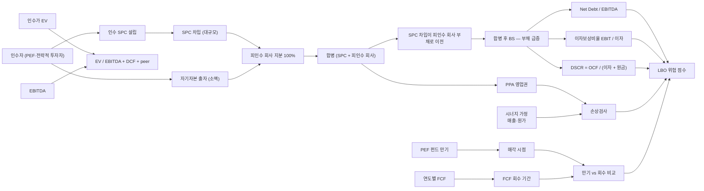

## 공개 호출 방식

```python
import dartlab
import polars as pl

target = "071840"  # 예 — 하이마트 (LBO 인수 사례)
c = dartlab.Company(target)

# 1. BS — 이자부 부채 + 차입금 시계열
ybs = c.show("BS", freq="Y")
qbs = c.show("BS", freq="Q")

# 2. IS — 이자비용 / 영업이익 / EBIT / EBITDA
yis = c.show("IS", freq="Y")
qis = c.show("IS", freq="Q")

# 3. CF — 영업현금흐름·CAPEX·FCF·배당
ycf = c.show("CF", freq="Y")
qcf = c.show("CF", freq="Q")

# 4. 인수·합병 공시
merger_disc = c.disclosure("합병") if hasattr(c, "disclosure") else None
acquisition_disc = c.disclosure("인수") if hasattr(c, "disclosure") else None

# 5. 차입금 본문 (만기·금리·담보)
borrowings = None
for topic in ("차입금", "사채", "장기차입금"):
    try:
        sec = c.show(topic) if hasattr(c, "show") else None
        if sec is not None and hasattr(sec, "shape"):
            borrowings = sec
            break
    except Exception:
        continue

ledger = {
    "is_years": yis.shape[1] - 2 if yis is not None else 0,
    "cf_loaded": ycf is not None,
    "merger_disc_loaded": merger_disc is not None,
    "acq_disc_loaded": acquisition_disc is not None,
    "borrowings_loaded": borrowings is not None,
}

emit_result(
    table=[ledger],
    values={"target": target, "lboAvail": borrowings is not None},
    date="latest",
)
```

## 호출 동작 — 5 단 분석 구조

### 1. 결론 도출

*LBO 거래 구조 + 인수가 적정성 + 부채부담 (Net Debt/EBITDA·이자보상·DSCR) + 의무상환 일정 + 합병 후 영업권 손상 가능성* 한 문장.

좋은 결론 예시:
- "하이마트 LBO 케이스 — 유진그룹 인수가 X 조원 / EBITDA Y = M 배 (EV/EBITDA). 인수 SPC 차입 N 조원 → 피인수 회사 합병 후 Net Debt/EBITDA = K 배 (LBO 기준 ≥ 5 배 위험). 이자보상비율 EBIT/이자 = L 배 (< 2 배 위험). PEF 펀드 만기 Z 년 → FCF 회수 기간 W 년 (만기 < 회수 기간 시 차환 의존). 합병 후 영업권 P 조원 → 시너지 가정 (매출 +Q%) 신뢰도 별도. *LBO 부채 부담 [높음] + 영업권 손상 위험 [중간] [conf:70]*. counter — 롯데 인수 후 재무 안정화 (롯데 캐시 백업) 으로 부담 완화."

금지:
- EV/EBITDA 단독으로 인수가 적정 단정.
- 합병 후 영업권 손상 = 시너지 부정확 단정 시 외부 환경 반례 누락.

### 2. 핵심 근거 수집

`requiredEvidence: skillRef + target + tableRef + valueRef + dateRef + sourceRef + executionRef` 필수.

- **target** (stockCode).
- **sourceRef**: 인수·합병 공시 (DART 주요사항보고서) + 차입금 주석 (만기·금리·담보) + PEF 운용 보고서 (가능 시 외부).
- **tableRef** (5+ 표):
  1. **LBO 거래 구조** — 인수자 (PEF·전략적 투자자) / 인수 SPC 명 / SPC 차입 규모 / 합병 시점 / 합병 후 차입 이전 여부
  2. **인수가 적정성** — EV/EBITDA + DCF + peer 비교 3 방식 동시 평가
  3. **피인수 회사 부채부담 시계열** — Net Debt/EBITDA · 이자보상비율 (EBIT/이자) · DSCR (OCF/이자+상환원금)
  4. **의무상환 일정 vs FCF 매칭** — 만기별 상환 의무 vs 연도별 FCF
  5. **합병 후 영업권** — PPA 영업권 잔액 + 손상검사 결과 + 시너지 가정 (매출·원가) ledger
- **valueRef**: EV/EBITDA multiple, Net Debt/EBITDA, 이자보상비율, FCF, 영업권 잔액.
- **dateRef**: 인수일·합병일·차입 만기일·PEF 펀드 만기일.
- **executionRef**: RunPython 으로 3 방식 평가 + 시계열 회귀 계산.

### 3. 메커니즘 분석

LBO 적정성 진단 = *거래 구조 + 인수가 + 부채부담 + 의무상환 + 영업권 5 차원 동시 검증*:



**5 패턴 정량 신호**:

| 패턴 | 신호 | 임계 | 가중치 |
|---|---|---|---|
| **인수가 적정** | EV/EBITDA vs peer 평균 | ±50% 이상 차이 | high |
| **인수가 적정** | DCF·peer·EV/EBITDA 3 방식 분산 | ≥ 30% | medium |
| **부채부담** | Net Debt / EBITDA | ≥ 5 배 | high |
| **부채부담** | 이자보상비율 (EBIT/이자) | < 2 배 | high |
| **부채부담** | DSCR = OCF / (이자 + 원금) | < 1.5 배 | high |
| **의무상환 매칭** | PEF 펀드 만기 vs FCF 회수 기간 | 만기 < 회수 (차환 의존) | high |
| **합병 후 영업권** | 영업권 / 자본총계 | ≥ 30% | medium |
| **시너지 가정 신뢰** | 합병 후 매출 / 시너지 가정 | < 70% / 3Y | high |
| **환원 패턴** | 합병 후 1~2Y 자사주·배당 (PEF 환원) | 발생 + 부채 동시 증가 | medium |

### 4. 반례·한계

- **Falsifier**: 인수 공시 본문 또는 차입금 주석 부재 시 LBO 적정성 판정 불가 — *DART 합병·인수 공시 + 차입금 주석 fetch 후 재호출*.
- **PEF 운용 정보 비공개**: 사모펀드 (PEF) 펀드 만기·매각 일정·LP·GP 구조는 *비공개* 가 다수 → 외부 보고서·언론·운용사 공시 별도 fetch 필요. dartlab L1/L1.5 범위 일부 한정.
- **시너지 가정 자기실현 어려움**: 인수가 산정 시 시너지 가정 (매출 +X% / 원가 절감 -Y%) 은 *예측* 이지 *fact* 아님. 합병 후 3~5 년 실현률 별도 검증.
- **롯데·SK 등 대기업 인수 시 캐시 백업**: 전략적 투자자 (대기업) 인수의 경우 *그룹 캐시 백업* 으로 부채부담 완화 가능. 단순 Net Debt/EBITDA 만으로 위험 단정 금지.
- **합병 직전 자사주 처분·발행**: 합병 직전 *자사주 처분* 또는 *신주 발행* 으로 인수자 지분 강화 가능. 거래 구조 본문 확인 필수.
- **외부 환경 변화**: 인수 후 다운사이클·환율·금리 충격 시 EBITDA 급감 → LBO 부담 자동 격상. 인수 책임 vs 환경 책임 분리 어려움.
- **차환 (refinancing) 옵션**: PEF 펀드 만기 < FCF 회수 기간이라도 *차환* (refinancing) 으로 만기 연장 가능. 차환 시장 환경 (금리·신용시장) 별도 평가.
- **인수가 < 시장가 케이스**: 부실 자산 인수 (저점 매수) 인 경우 EV/EBITDA peer 비교가 잘못된 기준 — DCF 또는 NAV 적용.

### 5. 후속 모니터링

| 신호 | 임계 | 조치 |
|---|---|---|
| Net Debt / EBITDA | ≥ 5 배 / 3Y | 부채부담 격상 |
| 이자보상비율 | < 2 배 | 즉시 위험 |
| DSCR | < 1.5 배 | 차환 의존 격상 |
| 합병 후 영업권 손상 | 발생 / 3Y | 시너지 가정 부정확 신호 |
| 합병 후 자사주·배당 | 발생 + 부채 증가 동행 | PEF 환원 의심 격상 |
| PEF 매각 시점 | 임박 (펀드 만기 -1Y) | 매각 후 부채 이전 추적 |
| 인수가 시계열 EBITDA 추세 | -10% / 1Y | 시너지 미실현 신호 |

## 대표 반환 형태

- `tableRef:lbo:transaction_structure` — LBO 거래 구조
- `tableRef:lbo:acquisition_appraisal` — 인수가 3 방식 평가
- `tableRef:lbo:debt_burden_timeseries` — 부채부담 시계열
- `tableRef:lbo:debt_service_schedule` — 의무상환 일정 vs FCF
- `tableRef:lbo:post_merger_goodwill` — 합병 후 영업권
- `valueRef:lbo:ev_ebitda` — EV/EBITDA
- `valueRef:lbo:net_debt_to_ebitda` — Net Debt / EBITDA
- `valueRef:lbo:interest_coverage_ratio` — 이자보상비율
- `valueRef:lbo:dscr` — DSCR
- `valueRef:lbo:goodwill_to_equity` — 영업권 / 자본총계
- `sourceRef:lbo:acquisition_id` — 인수 공시 id
- `sourceRef:lbo:merger_id` — 합병 공시 id
- `executionRef:lbo:calc_id` — RunPython 실행 id

## 연계 절차

- 합병비율 적정성 → `recipes.fundamental.quality.forensics.mergerRatioFairness`
- 영업권 손상 (합병 후 시너지 부정확) → `recipes.fundamental.quality.forensics.goodwillImpairmentCheck`
- 영구채·CB·RCPS 분류 (인수 자금 조달) → `recipes.fundamental.quality.forensics.hybridSecurityClassification`
- 사건 ↔ 재무 매칭 → `recipes.fundamental.quality.forensics.eventToStatementMatcher`
- EBITDA·OCF·인수가격 bridge → `recipes.fundamental.quality.ebitdaCashBridge`

재호출 트리거: "LBO 차입매수", "사모펀드 인수", "SPC 합병 부채 이전", "Net Debt EBITDA 인수", "PEF 만기 회수 매칭".

## 기본 검증

- 인수·합병 공시 + 차입금 주석 ≥ 1 종.
- 인수가 3 방식 평가 (EV/EBITDA + DCF + peer).
- 부채부담 3 비율 (Net Debt/EBITDA + 이자보상 + DSCR).
- 합병 후 영업권 시계열 ≥ 3 년.
- PEF 펀드 만기 vs FCF 회수 기간 비교.
- falsifier — PEF 운용 비공개 한계 명시.

## AI 직접 사용 방식

1. `ReadSkill` 에서 LBO·사모펀드·차입매수 질문이면 본 recipe 선정.
2. target stockCode 확인 (피인수 회사 기준).
3. `Company.show("BS","IS","CF",freq="Y")` 시계열 + 분기 보완.
4. `Company.disclosure("인수","합병")` 거래 공시.
5. `Company.show("차입금")` 만기·금리·담보 주석.
6. RunPython 으로 3 방식 평가 + 3 비율 시계열 + 영업권 손상 계산.
7. 답변에 *거래 구조 + 인수가 평가 + 부채부담 시계열 + 의무상환 + 영업권* 5 셋 + 반례·한계 필수.
