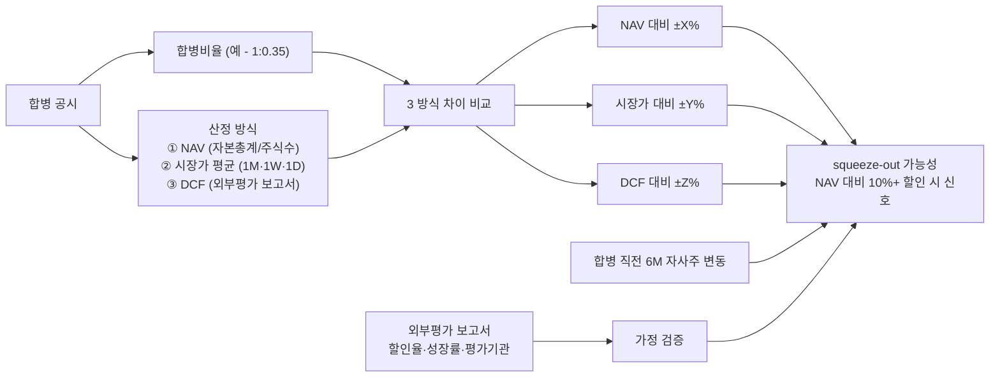

## 공개 호출 방식

```python
import dartlab
import polars as pl

# 합병 당사사 양쪽 — target = 합병 주체, counter = 합병 대상
target = "028260"  # 예 — 삼성물산
counter = "001300"  # 예 — 제일모직 (구)

c_t = dartlab.Company(target)
c_c = dartlab.Company(counter)

# 1. 최근 5 년 BS / IS — NAV / 시장가 / 이익 baseline
metrics_t = {
    "BS": c_t.show("BS", freq="Y"),
    "IS": c_t.show("IS", freq="Y"),
}
metrics_c = {
    "BS": c_c.show("BS", freq="Y"),
    "IS": c_c.show("IS", freq="Y"),
}

# 2. 합병 공시 본문 (가능 시)
merger_sections = {}
for c, label in [(c_t, "target"), (c_c, "counter")]:
    try:
        merger_sections[label] = c.disclosure("합병") if hasattr(c, "disclosure") else None
    except Exception:
        merger_sections[label] = None

# 3. 자기주식 처분·취득 시계열
treasury = {}
for c, label in [(c_t, "target"), (c_c, "counter")]:
    try:
        treasury[label] = c.show("treasury") if "treasury" in (c.topics if hasattr(c, "topics") else []) else None
    except Exception:
        treasury[label] = None

# 4. 외부평가 가정 ledger
assumptions_ledger = {
    "target": {
        "BS_years": len([col for col in metrics_t["BS"].columns if str(col)[:4].isdigit()]),
        "merger_section_loaded": merger_sections["target"] is not None,
    },
    "counter": {
        "BS_years": len([col for col in metrics_c["BS"].columns if str(col)[:4].isdigit()]),
        "merger_section_loaded": merger_sections["counter"] is not None,
    },
}

emit_result(
    table=[
        {"side": "target", **assumptions_ledger["target"]},
        {"side": "counter", **assumptions_ledger["counter"]},
    ],
    values={
        "targetCode": target,
        "counterCode": counter,
        "mergerSectionAvail": sum(1 for v in merger_sections.values() if v is not None),
    },
    date="latest",
)
```

## 호출 동작 — 5 단 분석 구조

### 1. 결론 도출

*합병비율 산정식 분해 + 3 평가 방식 (NAV/시장가/DCF) 비교 + 소수주주 squeeze-out 가능성* 한 문장.

좋은 결론 예시:
- "삼성물산-제일모직 1:0.35 합병비율 — NAV 대비 삼성물산 -X% 할인, 시장가 대비 ±Y%, DCF 대비 -Z%. 합병 직전 1 개월 시장가 평균이 NAV 의 60% 수준이라 *소수주주 squeeze-out 우려 [conf:60]*. 외부평가 외부평가기관이 그룹 자문 빈도 큰 곳임 — 이해상충 가능성 별도 [counter evidence]."

금지:
- 단일 평가 방식 (시장가) 만으로 적정 단정.
- 외부평가 보고서 가정 (할인율·성장률) 미명시.

### 2. 핵심 근거 수집

`requiredEvidence: skillRef + target + tableRef + valueRef + dateRef + sourceRef + executionRef` 필수.

- **target** + **counter** (합병 양쪽 stockCode).
- **sourceRef**: 합병 공시 본문 (DART 주요사항보고서 / 합병결정·합병계약서·외부평가기관 보고서). 보고서 외부 출처 / 평가기관명·평가일·평가범위 명시.
- **tableRef** (4+ 표):
  1. **합병비율 산정** — 합병주체 1 주 당 대상 X 주, 산정 시점 시장가 평균 (1 개월·1 주일·1 일), NAV·DCF 결과
  2. **3 방식 비교** — NAV 대비 / 시장가 대비 / DCF 대비 합병비율 차이 %
  3. **외부평가 가정** — 할인율·성장률·multiple·평가범위·평가기관·평가일·이해상충 여부
  4. **자기주식 변동** — 합병 직전 6 개월 자사주 취득·처분·소각 시계열 + 대주주 지분 변동
- **valueRef**: NAV (자본총계·자본금·자본잉여금), 합병가액, 시장가 평균, 외부평가 결과.
- **dateRef**: 합병결정일·합병기일·평가일·시장가 평균 기간.
- **executionRef**: RunPython 으로 3 방식 비교 계산.

### 3. 메커니즘 분석

합병비율 적정성 = *3 평가 방식 (NAV/시장가/DCF) 일관성 + 외부평가 가정 검증 + 자기주식 + 대주주 지분 변동 동행 확인*:



**평가 방식 정의**:

| 방식 | 산식 | dartlab 데이터 |
|---|---|---|
| **NAV** | 자본총계 / 주식수 | `Company.show("BS").자본총계` + `Company.show("BS").주식수` |
| **시장가** | 합병 직전 1M / 1W / 1D 평균 | `Company.gather("price")` 시계열 |
| **DCF** | 외부평가 보고서 (할인율·성장률·multiple) | 공시 본문 `Company.disclosure("합병")` |
| **PER multiple** | 산업 평균 × EPS | `Company.analysis(valuation, 가치평가).relativeValuation` |

**squeeze-out 신호 정량**:

| 신호 | 임계 | 가중치 |
|---|---|---|
| 시장가 평균 대비 NAV 할인폭 | ≥ 30% | high |
| 합병 직전 6M 시장가 ±20% 이상 변동 | 발생 | high |
| 자기주식 처분 vs 합병 결합 | 동시 발생 | high |
| 외부평가 의뢰자 = 모회사 / 그룹 자문 빈도 큼 | 발생 | medium |
| 합병 직전 자사주 매수 1 개월 내 | 발생 | medium |
| 합병 후 ROE / EPS 즉시 희석 | 동행 | low |

### 4. 반례·한계

- **Falsifier**: 합병 공시 본문 또는 외부평가 보고서 부재 시 적정성 판정 불가 — *공시 원문 확인 후 재호출*.
- **NAV 의 한계**: 회계 장부가 ≠ 실제 가치. 토지·무형자산은 *역사적 원가* 라 NAV 가 저평가될 수 있음. 부동산 비중 큰 회사일수록 NAV 과소.
- **외부평가 이해상충**: 평가기관이 모회사 자문 빈도 큰 곳이면 *친 모회사 가정* 가능. 평가기관 history 별도 확인.
- **합병 직전 주가 인위 조작 가능성**: 합병 발표 직전 자사주 매수·매도로 시장가 평균 왜곡. 합병 발표 직전 6M 거래 패턴 확인.
- **합병 시너지 가정**: DCF 모델이 *합병 시너지* (매출 증가·원가 절감) 를 가정한 경우 신뢰도 낮음. 합병 전 두 회사 standalone 도 함께 검증.
- **소수주주 보호 법규**: 한국 상법 522 조 (반대주주 매수청구) · 외부평가 의무 시점 등 법적 요건 별도. 본 절차는 *정량 신호* 만.

### 5. 후속 모니터링

| 신호 | 임계 | 조치 |
|---|---|---|
| 합병 후 EPS 회복 | 4 분기 내 -10% 이내 | 합병 시너지 가정 검증 |
| 합병 후 ROE 변동 | ±5%p 이상 변동 | 자본 효율 검증 |
| 영업권 손상 | 합병 후 3 년 내 발생 | PPA 가정 부정확 신호 |
| 반대주주 매수청구 행사 비율 | 발행주식 5%+ | 소수주주 불만 정량 |
| 외부평가기관 history | 모회사 자문 빈도 추적 | 이해상충 메모 |

## 대표 반환 형태

- `tableRef:merger:ratio_breakdown` — 합병비율 산정식 분해
- `tableRef:merger:three_method_compare` — NAV/시장가/DCF 비교
- `tableRef:merger:external_eval_assumptions` — 외부평가 가정 ledger
- `tableRef:merger:treasury_timeline` — 자기주식 변동 시계열
- `valueRef:merger:nav_gap_pct` — NAV 대비 합병비율 차이
- `valueRef:merger:squeeze_out_score` — squeeze-out 신호 점수
- `sourceRef:merger:disclosure_id` — 합병 공시 id
- `executionRef:merger:calc_id` — RunPython 실행 id

## 연계 절차

- 영업권 손상검사 → `recipes.fundamental.quality.forensics.goodwillImpairmentCheck`
- 사건 ↔ 재무 매칭 → `recipes.fundamental.quality.forensics.eventToStatementMatcher`
- 계정 추적 → `recipes.fundamental.quality.forensics.accountTraceLedger`
- 주석 신호 (계속기업·정정) → `recipes.fundamental.quality.forensics.noteSignalExtractor`
- valuation 깊이 → `recipes.fundamental.valuation.check`

재호출 트리거: "합병비율 적정성", "삼성물산 제일모직 합병", "SK C&C SK 합병", "NAV 대비 squeeze out".

## 기본 검증

- 합병 양쪽 stockCode 명시.
- 3 평가 방식 (NAV / 시장가 / DCF) 모두 정량 비교.
- 외부평가 가정 (할인율 / 성장률 / 평가기관 / 평가일) 최소 4 종 명시.
- 자기주식 + 대주주 지분 변동 시계열 ≥ 6 개월.
- falsifier — 공시 본문 부재 시 결론 보류.

## AI 직접 사용 방식

1. `ReadSkill` 에서 합병·분할 질문이면 본 recipe 선정.
2. 합병 양쪽 stockCode 확인 — 사용자 명시 또는 공시 검색.
3. `Company.show` BS/IS 최근 5 년 양쪽.
4. `Company.disclosure("합병")` 공시 본문 — 가능 시.
5. RunPython 으로 NAV/시장가/DCF 3 방식 계산.
6. squeeze-out 신호 점수 산출.
7. 답변에 *3 방식 비교 표 + 외부평가 가정 ledger + 자기주식 시계열* 3 셋 + 반례·한계 필수.
