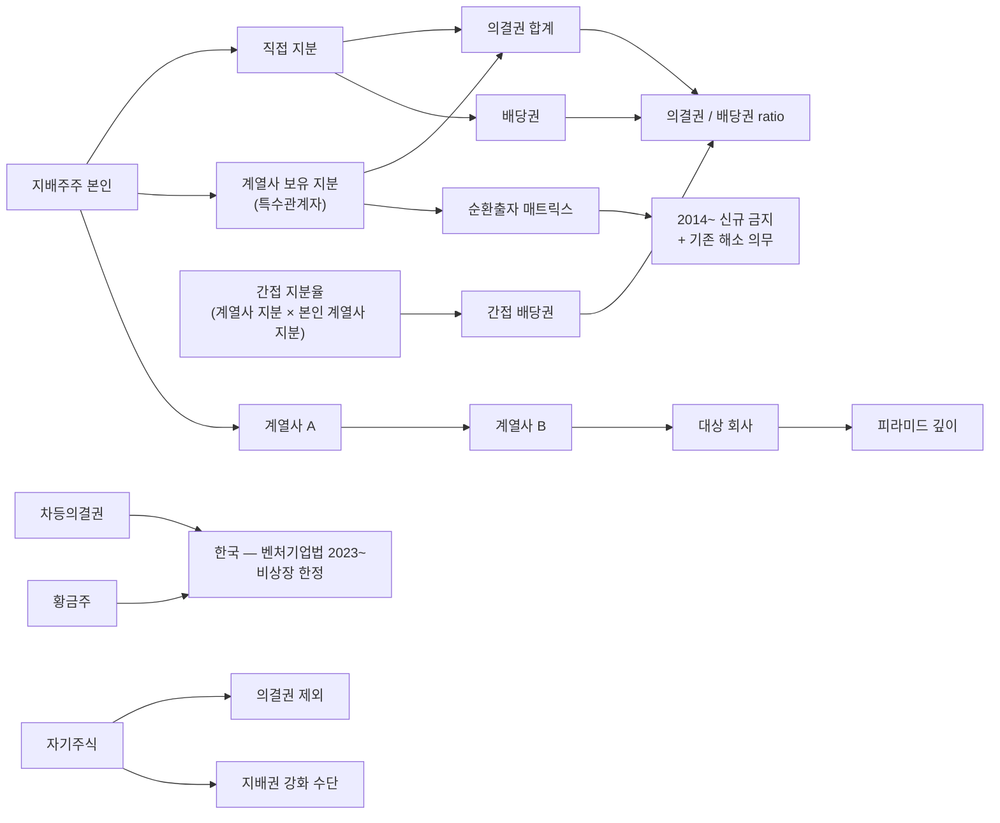

## 공개 호출 방식

```python
import dartlab
import polars as pl

target = "005930"  # 예 — 삼성전자
c = dartlab.Company(target)

# 1. 주주현황 — 지배주주·특수관계자 지분율
shareholders = None
for topic in ("주주현황", "최대주주", "특수관계자"):
    try:
        sec = c.show(topic) if hasattr(c, "show") else None
        if sec is not None and hasattr(sec, "shape"):
            shareholders = sec
            break
    except Exception:
        continue

# 2. 계열회사 / 종속기업 / 관계기업 — 피라미드 매핑
affiliates = c.show("종속기업") if hasattr(c, "show") else None
related = c.show("관계기업") if hasattr(c, "show") else None

# 3. BS — 자기주식·우선주
ybs = c.show("BS", freq="Y")

# 4. 횡단 — governance axis
gov = dartlab.scan("governance")
gov_row = gov.filter(pl.col("stockCode") == target) if "stockCode" in gov.columns else None

ledger = {
    "shareholders_loaded": shareholders is not None,
    "affiliates_loaded": affiliates is not None,
    "related_loaded": related is not None,
    "gov_row_loaded": gov_row is not None and gov_row.height > 0,
}

emit_result(
    table=[ledger],
    values={"target": target, "shareholdersAvail": shareholders is not None},
    date="latest",
)
```

## 호출 동작 — 5 단 분석 구조

### 1. 결론 도출

*의결권 vs 배당권 괴리 + 순환출자 고리 + 피라미드 깊이 + 차등의결권 활용 + 지주사 전환 효과* 한 문장.

좋은 결론 예시:
- "삼성그룹 케이스 — 지배주주 직접 지분 X%, 그룹 의결권 (계열사 우호 지분 합산) Y%. 의결권 / 배당권 = M 배 (괴리). 피라미드 깊이 K 단계 (지배주주 → A → B → C → 삼성전자). 자기주식 잔액 Z%. 순환출자 잔존 없음 (2014 이후 해소). 차등의결권 미도입 (벤처기업법 미적용). *피라미드 깊이 [높음] + 의결권 괴리 [큼] [conf:75]*. counter — 한국 일반 기업은 차등의결권 미허용 환경이라 *지분 < 의결권* 패턴이 *제도적 구조* 의 산물 측면 별도 메모."

금지:
- 우선주·자기주식 의결권 제외 미고려.
- 한국 차등의결권 단정 시 벤처기업법 2023 시행 + 비상장 한정 조건 미명시.

### 2. 핵심 근거 수집

`requiredEvidence: skillRef + target + tableRef + valueRef + dateRef + sourceRef + executionRef` 필수.

- **target** (stockCode).
- **sourceRef**: 사업보고서 주주현황·계열회사·특수관계자 섹션 + 지주사 전환 공시 + 지분 변동 공시.
- **tableRef** (4+ 표):
  1. **의결권 vs 배당권 매트릭스** — 지배주주·특수관계자 직접 지분 / 의결권 / 배당권 / 우선주 / 자기주식 분리
  2. **피라미드 그래프** — 지배주주 → 계열사 A → 계열사 B → 대상 회사 (간접 지분율 곱셈)
  3. **순환출자 고리** — 계열사 간 상호 지분 매트릭스 (2014 이전 보유분 vs 신규)
  4. **차등의결권·황금주 ledger** — 도입 시점·조건·잔존 (한국 벤처기업법 2023~ 적용 여부)
- **valueRef**: 직접 지분 %, 의결권 %, 배당권 %, 의결권/배당권 비율, 피라미드 깊이, 자기주식 %.
- **dateRef**: 지분 변동일·지주사 전환일·차등의결권 도입일.
- **executionRef**: RunPython 으로 간접 지분 곱셈 + 의결권 합산 계산.

### 3. 메커니즘 분석

지분율 괴리도 진단 = *의결권 vs 배당권 + 피라미드 깊이 + 순환출자 + 차등의결권 4 차원 동시 검증*:



**5 패턴 정량 신호**:

| 패턴 | 신호 | 임계 | 가중치 |
|---|---|---|---|
| **의결권 / 배당권 괴리** | 의결권 / 배당권 비율 | ≥ 2 배 | high |
| **피라미드 깊이** | 지배주주 → 대상 회사 단계 수 | ≥ 4 단계 | high |
| **간접 지분율** | 본인 계열사 지분 × 계열사 대상 지분 | ≤ 15% (간접) | medium |
| **자기주식 활용** | 자기주식 / 발행주식 | ≥ 10% | medium |
| **순환출자 잔존** | 2014 이후 신규 발생 | 발생 | high |
| **순환출자 해소** | 2014 이전 보유분 해소 진행 | 미해소 잔존 | medium |
| **차등의결권 (한국)** | 벤처기업법 2023~ 적용 여부 | 비상장 + 요건 충족 | high |
| **황금주 보유** | 거부권 보유 잔존 | 발생 | high |

### 4. 반례·한계

- **Falsifier**: 주주현황·계열회사 본문 부재 시 괴리도 정량화 불가 — *사업보고서 지분율 섹션 + 계열회사 현황 fetch 후 재호출*.
- **한국 차등의결권 제도 차이**: 한국은 *상장사 차등의결권 미허용* 이라 일반 기업에서 차등의결권 단정 금지. 벤처기업법 2023 시행으로 *비상장 벤처* 한정 허용. 미국 (구글·메타·알리바바) 듀얼클래스 와 직접 비교 어려움.
- **순환출자 grandfather 조항**: 2014 공정거래법 개정으로 *신규 순환출자* 금지지만 *기존 보유분* 은 일정 기간 해소 의무. 단순 잔존 = 위법 단정 금지.
- **간접 지분율 계산 방법**: 피라미드 통과 시 *지분율 곱셈* 이 표준이지만 *의결권* 은 *지배 다수결* 원칙 (50% 이상 보유 시 100% 의결권 통제) 으로 곱셈 ≠ 의결권. 본 recipe 에서는 배당권 만 곱셈, 의결권은 *지배 다수결* 적용.
- **자기주식 의결권 제외**: 자기주식은 의결권 제외이지만 *처분 시* 의결권 부활. 단순 잔액 보다 *처분 가능성* 동행 평가.
- **우선주 의결권**: 한국 우선주는 *무의결권* 이 일반이라 의결권에서 제외. 단 *전환우선주* 는 전환 시 의결권 부활.
- **황금주 한국 미허용**: 한국 일반 기업 황금주 미허용. 다만 *외국 합작 회사* (예 일부 외국 자본 진출 사례) 에서 잔존 가능.
- **연결 vs 별도**: 본 recipe 는 *지배 구조 진단* 이라 별도 재무제표 (지분만) 기준. 연결 재무제표와 다를 수 있음.

### 5. 후속 모니터링

| 신호 | 임계 | 조치 |
|---|---|---|
| 의결권 / 배당권 비율 | ≥ 2 배 | 괴리도 ledger 작성 |
| 피라미드 깊이 | ≥ 4 단계 | 지배 구조 복잡도 격상 |
| 자기주식 비중 | ≥ 10% | 잠재 의결권 부활 우려 |
| 순환출자 신규 (2014~) | 발생 | 즉시 위법 의심 |
| 차등의결권 도입 | 도입 발표 | 조건 + 시점 ledger |
| 지주사 전환 | 진행 | 지배권 변화 별도 시뮬레이션 |
| 외국인 지분 변동 | ±5%p / 1Y | 경영권 분쟁 동행 확인 |

## 대표 반환 형태

- `tableRef:ownership:voting_vs_dividend` — 의결권 vs 배당권 매트릭스
- `tableRef:ownership:pyramid_graph` — 피라미드 그래프
- `tableRef:ownership:circular_matrix` — 순환출자 매트릭스
- `tableRef:ownership:dual_class_ledger` — 차등의결권·황금주 ledger
- `valueRef:ownership:voting_dividend_ratio` — 의결권/배당권 비율
- `valueRef:ownership:pyramid_depth` — 피라미드 깊이
- `valueRef:ownership:treasury_pct` — 자기주식 비중
- `valueRef:ownership:indirect_stake_pct` — 간접 지분율
- `sourceRef:ownership:shareholders_id` — 주주현황 섹션 id
- `executionRef:ownership:calc_id` — RunPython 실행 id

## 연계 절차

- 실질지배력 (의결권 합산 동행) → `recipes.fundamental.quality.forensics.controllingPowerJudgment`
- 자사주 활용 (지배권 강화 수단) → `recipes.fundamental.quality.forensics.treasuryStockUsage`
- 합병비율 (지주사 전환 동행) → `recipes.fundamental.quality.forensics.mergerRatioFairness`
- 사건 ↔ 재무 매칭 → `recipes.fundamental.quality.forensics.eventToStatementMatcher`

재호출 트리거: "지분율 괴리도", "순환출자", "피라미드 지배구조", "차등의결권", "지주사 전환 지배권".

## 기본 검증

- 직접 지분 + 의결권 + 배당권 분리.
- 우선주·자기주식 의결권 제외 처리.
- 피라미드 깊이 계산 (간접 지분 곱셈 명시).
- 순환출자 매트릭스 (2014 이전·이후 분리).
- 차등의결권·황금주 도입 여부 + 한국 제도 시점 명시.
- falsifier — 차등의결권 한국 제도 시점 (벤처기업법 2023) 명시.

## AI 직접 사용 방식

1. `ReadSkill` 에서 지분율·지배구조·순환출자 질문이면 본 recipe 선정.
2. target stockCode 확인.
3. `Company.show("주주현황")` + `Company.show("최대주주")` + `Company.show("특수관계자")` 본문.
4. `Company.show("종속기업")` + `Company.show("관계기업")` 계열사 매핑.
5. `Company.show("BS", freq="Y")` 자기주식·우선주 잔액.
6. `scan("governance")` 횡단 비교.
7. RunPython 으로 의결권/배당권 + 간접 지분 + 피라미드 깊이 계산.
8. 답변에 *의결권 vs 배당권 + 피라미드 그래프 + 순환출자 매트릭스 + 차등의결권 ledger* 4 셋 + 반례·한계 필수.
