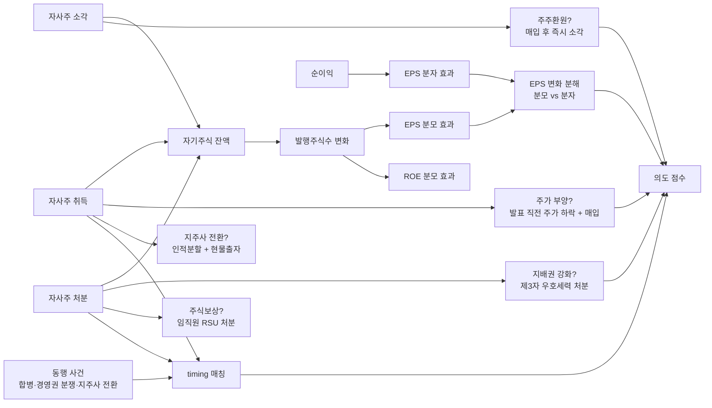

## 공개 호출 방식

```python
import dartlab
import polars as pl

target = "005930"  # 예 — 삼성전자
c = dartlab.Company(target)

# 1. 자기주식 시계열 — 취득·처분·소각
treasury = None
for topic in ("treasury", "자기주식", "자사주"):
    try:
        sec = c.show(topic) if hasattr(c, "show") else None
        if sec is not None and hasattr(sec, "shape"):
            treasury = sec
            break
    except Exception:
        continue

# 2. BS / IS — 자본 항목 + EPS / ROE 동행
qbs = c.show("BS", freq="Q")
qis = c.show("IS", freq="Q")
ybs = c.show("BS", freq="Y")
yis = c.show("IS", freq="Y")

# 3. 자사주 공시 — 취득·처분·소각·합병
treasury_disc = c.disclosure("자기주식") if hasattr(c, "disclosure") else None

# 4. 횡단 — capital axis (자사주·증감자·배당)
cap_scan = dartlab.scan("capital")
cap_row = cap_scan.filter(pl.col("stockCode") == target) if "stockCode" in cap_scan.columns else None

ledger = {
    "treasury_loaded": treasury is not None,
    "treasury_disc_loaded": treasury_disc is not None,
    "qis_quarters": qis.shape[1] - 2 if qis is not None else 0,
    "cap_row_loaded": cap_row is not None and cap_row.height > 0,
}

emit_result(
    table=[ledger],
    values={"target": target, "treasuryAvail": treasury is not None},
    date="latest",
)
```

## 호출 동작 — 5 단 분석 구조

### 1. 결론 도출

*자사주 변동 시계열 + 의도 분류 + EPS/ROE 분모 효과 + 동행 사건 timing* 한 문장.

좋은 결론 예시:
- "삼성전자 자사주 매입 X 조원 (직전 5 년 누적), 소각 Y 조원 / 매입 (소각률 Z%). 매입 시점 평균 주가 P0 vs 발표 직전 1M 주가 -N%. 매입 후 4 분기 EPS +M% (분모 효과 약 K%p, 분자 효과 약 L%p). 동행 사건 — 지주사 전환 검토 / 주주환원 정책 공시. *주주환원 + EPS 부양 혼합 의도 [conf:70]*. counter — 자회사 주식보상 적립 부분 (RSU 발행 동행) 별도 검토."

금지:
- 단일 신호 (취득 OR 처분 OR 소각) 만으로 의도 단정.
- EPS 점프 = 자사주 효과 단정 시 분모/분자 분리 누락.

### 2. 핵심 근거 수집

`requiredEvidence: skillRef + target + tableRef + valueRef + dateRef + sourceRef + executionRef` 필수.

- **target** (stockCode).
- **sourceRef**: 자사주 취득·처분·소각 공시 (DART 주요사항보고서) / 자사주 임직원 처분 본문 (제3자 상대방) / 합병 신주배정 공시 (자사주 활용).
- **tableRef** (4+ 표):
  1. **자사주 변동 시계열** — 분기·연도별 취득 / 처분 / 소각 수량·금액·평균가
  2. **의도 분류 매트릭스** — 주가 부양 (매입+소각) / 지배권 강화 (제3자 처분) / 주식보상 (임직원 처분) / 지주사 전환 (현물출자)
  3. **EPS·ROE 분모 효과** — 자사주 매입 후 EPS·ROE 변화 / 분모 (주식수) 효과 vs 분자 (이익) 효과 분리
  4. **동행 사건 timing** — 경영권 분쟁·합병 발표·지주사 전환 검토일 ↔ 자사주 거래 timestamp
- **valueRef**: 누적 매입·처분·소각 금액, 소각률 (소각 / 매입), EPS 점프 폭, 분모 효과 %p.
- **dateRef**: 자사주 거래일·합병결정일·경영권 분쟁 timestamp.
- **executionRef**: RunPython 으로 EPS 분해 + 시계열 회귀.

### 3. 메커니즘 분석

자사주 의도 진단 = *변동 시계열 + 4 의도 분류 + EPS/ROE 분모 효과 + 동행 사건 timing 4 차원 동시 검증*:



**5 의도 매트릭스 신호**:

| 의도 | 신호 패턴 | 정량 임계 | 가중치 |
|---|---|---|---|
| **주가 부양** | 매입 발표 직전 1M 주가 변동 | ≤ -10% | medium |
| **주가 부양** | 매입 발표 후 1M 주가 변동 | ≥ +5% | medium |
| **주주환원 (긍정)** | 소각률 = 소각 / 매입 | ≥ 50% / 3Y | high |
| **주주환원 (긍정)** | 동행 신주 발행 (CB·증자) 잠재 희석 | 부재 | high |
| **지배권 강화** | 제3자 우호세력 처분 비중 | ≥ 30% / 처분 | high |
| **지배권 강화** | 경영권 분쟁 timestamp 동행 | 동행 | high |
| **주식보상** | 임직원 RSU·스톡옵션 행사 동행 | 동행 | medium |
| **지주사 전환** | 인적분할 + 현물출자 비율 | ≥ 50% | high |
| **EPS 분모 효과** | EPS 점프 중 분모 (주식수) 기여 | ≥ 50% | medium |

### 4. 반례·한계

- **Falsifier**: 자사주 변동 공시 또는 처분 상대방 정보 부재 시 의도 판정 불가 — *DART 자기주식취득·처분 공시 fetch 후 재호출*.
- **매입 + 미소각 = 부양 의심**: 매입 후 장기간 자기주식 잔존 시 *향후 처분 옵션* 보유로 보면 잠재 dilution. 매입만으로 주주환원 단정 금지.
- **합병 신주배정 자사주 활용**: 합병 시 자기주식을 *피합병회사 주주* 에게 배정하는 케이스 — *지배권 강화* 와 *합병 정상 목적* 분리 어려움. 합병비율·외부평가 동행 검증.
- **지주사 전환 정상 목적**: 인적분할 후 현물출자 자체는 지배구조 단순화 등 정상 목적 인정. 다만 *지배권 강화 효과* (지분율 상승) 별도 정량 검증.
- **소각률 측정 시계**: 소각률 = 소각 / 매입 인데 매입 후 수년 후 소각하는 패턴이 있어 *단기 ratio* 만 보면 환원 의도 과소.
- **임직원 처분 정상 목적**: RSU·스톡옵션 행사 처분은 보상 정상 목적. 다만 *행사 시점 호재 timing* 동행 시 [[executiveCompensationAudit]] 와 결합 검증.
- **공정거래법·세법 제약**: 자사주 활용은 공정거래법·세법 (특수관계자 거래) 제약이 있어 *법적 한계* 안 정상 활용도 多. 단순 패턴만으로 의도 단정 금지.

### 5. 후속 모니터링

| 신호 | 임계 | 조치 |
|---|---|---|
| 누적 매입 / 시가총액 | ≥ 5% / 3Y | 부양 의도 ledger 작성 |
| 소각률 (소각/매입) | < 30% / 5Y | 잠재 dilution 의심 |
| 제3자 처분 비중 | ≥ 30% | 지배권 강화 의심 격상 |
| 경영권 분쟁 동행 처분 | 동행 | 가중치 high |
| EPS 점프 분모 효과 비중 | ≥ 50% | 분모 game 의심 |
| 지주사 전환 동행 | 동행 | 현물출자 비율 별도 계산 |
| 동행 CB·증자 발행 | 동행 | 잠재 희석 ledger |

## 대표 반환 형태

- `tableRef:treasury:variation_timeseries` — 자사주 변동 시계열
- `tableRef:treasury:intent_matrix` — 의도 분류 매트릭스
- `tableRef:treasury:eps_decomposition` — EPS 분모/분자 분해
- `tableRef:treasury:event_timing` — 동행 사건 timing
- `valueRef:treasury:cumulative_acq` — 누적 매입 금액
- `valueRef:treasury:burn_rate` — 소각률
- `valueRef:treasury:third_party_disp_pct` — 제3자 처분 비중
- `valueRef:treasury:denom_effect_pct` — EPS 분모 효과 %
- `sourceRef:treasury:disclosure_id` — 자사주 공시 id
- `executionRef:treasury:calc_id` — RunPython 실행 id

## 연계 절차

- 실질지배력 (지분 변동 동행) → `recipes.fundamental.quality.forensics.controllingPowerJudgment`
- 임원 보수 (스톡옵션 행사 동행) → `recipes.fundamental.quality.forensics.executiveCompensationAudit`
- 합병비율 (자사주 합병 활용) → `recipes.fundamental.quality.forensics.mergerRatioFairness`
- 공시 timing (자사주 timestamp ↔ 호재) → `recipes.fundamental.quality.forensics.disclosureTimingAnomaly`

재호출 트리거: "자사주 매입 의도", "자사주 소각", "지주사 전환 자기주식", "경영권 분쟁 자사주", "EPS 분모 game".

## 기본 검증

- 자사주 변동 시계열 ≥ 3 년.
- 4 의도 분류 (부양 / 환원 / 지배권 / 보상 / 지주사) 모두 가능성 평가.
- EPS / ROE 분모 효과 분리 계산.
- 동행 사건 (합병·분쟁·지주사) timestamp 매칭.
- 소각률 (소각/매입) 명시.
- falsifier — 처분 상대방 정보 부재 시 의도 보류.

## AI 직접 사용 방식

1. `ReadSkill` 에서 자사주·자기주식 질문이면 본 recipe 선정.
2. target stockCode 확인.
3. `Company.show("자기주식")` 또는 `Company.show("treasury")` 변동 시계열.
4. `Company.show("BS", freq="Q")` + `Company.show("IS", freq="Q")` 자본·EPS 동행.
5. `Company.disclosure("자기주식")` 거래 timestamp + 처분 상대방.
6. `scan("capital")` 횡단 비교.
7. RunPython 으로 5 의도 매트릭스 + EPS 분해 계산.
8. 답변에 *자사주 변동 + 의도 매트릭스 + EPS 분해 + 동행 사건 timing* 4 셋 + 반례·한계 필수.
