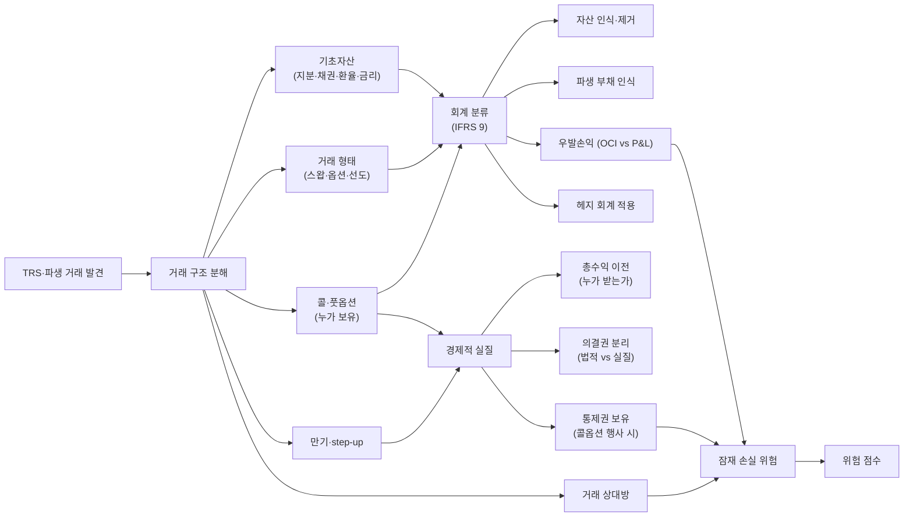

## 공개 호출 방식

AI 도구 실행 순서는 `EngineCall` 우선이다. `Company.show("IS"|"BS"|"CF")`, `Company.disclosure`, `scan.quality`, `scan.audit`, `scan.disclosureRisk` 는 엔진 호출로 근거를 먼저 확보한다. 아래 Python 블록은 확보한 L1/L1.5 근거를 `buildEvidenceForensicsMemo` 로 묶는 **RunPython fallback** 절차다 — TRS 파생 — 계정 추적.

```python
import dartlab
from dartlab.synth.evidenceForensics import buildEvidenceForensicsMemo

target = "005930"  # KOSPI/KOSDAQ 종목코드
c = dartlab.Company(target)

statements = {}
for topic in ("IS", "BS", "CF"):
    try:
        statements[topic] = c.show(topic, freq="Y")
    except TypeError:
        statements[topic] = c.show(topic)
    except Exception:
        pass

sectionTexts = {}
for topic in ("businessOverview", "riskFactors", "mdna", "notesDetail"):
    try:
        sectionTexts[topic] = str(c.show(topic))[:20000]
    except Exception:
        pass

try:
    disclosure = c.disclosure()
    events = disclosure.head(20).to_dicts() if hasattr(disclosure, "head") else list(disclosure)[:20]
except Exception:
    events = []

scanRows = []
for axis in ("quality", "audit", "disclosureRisk"):
    try:
        df = dartlab.scan(axis)
        rows = df.head(3).to_dicts() if hasattr(df, "head") else []
        for row in rows:
            row["axis"] = axis
        scanRows.extend(rows)
    except Exception:
        pass

memo = buildEvidenceForensicsMemo(
    target=target,
    market=str(getattr(c, "market", "KR")),
    companyName=str(getattr(c, "corpName", target)),
    statements=statements,
    sectionTexts=sectionTexts,
    events=events,
    scanRows=scanRows,
)

emit_result(
    table=memo["tables"]["accountTraceLedger"],
    values={
        "target": target,
        "riskScore": memo["headline"].get("riskScore"),
        "signalCount": memo["headline"].get("signalCount"),
    },
    date=memo.get("asOf", "latest"),
    sources=memo["sources"],
)
```

## 호출 동작 — 5 단 분석 구조

### 1. 결론 도출

*파생 잔액 + TRS 거래 구조 + 자산 제거 가능성 + 의결권 분리 + 잠재 손실 점수* 한 문장.

좋은 결론 예시:
- "017800 (현대엘리베이터) TRS + 콜옵션 부가 CB — 넥스젠캐피탈 거래로 *형식상 지분 매각* 이지만 *총수익 이전 + 콜옵션 보유* 로 실질 보유 효과. 자산 제거 후 회계상 부채 미기록 — *경제적 실질 부채 성격* [conf:70]. 쉰들러 소송 진행 + 분기 평가손익 변동 큰 종목."
- "태산LCD KIKO — 통화선도 + 옵션 결합 구조. 환율 1,000원 이상 시 무한 손실. 일반 통화선도 (선형) vs 옵션 결합 (비선형) 차이 인지 부재가 핵심 — 전문 인력 양성 권장."

금지:
- 파생 잔액 + 표면 손익 만으로 단정.
- TRS 의 경제적 실질 (총수익 + 의결권 보유) 와 법적 형식 (지분 매각) 혼동.
- SPC 활용 거래에서 SPC 통제권 평가 누락.

### 2. 핵심 근거 수집

`requiredEvidence: skillRef + target + tableRef + valueRef + dateRef + sourceRef + executionRef` 필수.

- **target**: stockCode.
- **sourceRef**: 사업보고서 주석 (파생·차입금·충당부채 sections) + 공시 본문 (TRS·풋옵션·KIKO 계약 공시·집행 공시·법원 판결).
- **tableRef** (3+ 표):
  1. **파생자산·부채 시계열** — 5+ 년 BS 파생 항목별 잔액 + 분기 평가손익
  2. **거래 ledger** — TRS·옵션 거래별 (상대방·만기·기초자산·계약 금액·콜·풋·step-up)
  3. **회계 분류 매트릭스** — 거래별 (자산 제거 가능성·부채 인식·우발손익·OCI vs 당기손익)
- **valueRef**: 파생 잔액·평가손익·계약 금액·시총 대비 비율.
- **dateRef**: 거래 시점·만기·평가 시점·법원 판결 시점.
- **sourceRef**: 파생 sections id·거래 공시 id.
- **executionRef**: RunPython 계산 id.

### 3. 메커니즘 분석

TRS·파생 진단 = *거래 구조 분해 + 회계상 분류 (IFRS 9) + 경제적 실질 평가 + 의결권·통제 분리 + 잠재 손실*:



**거래 유형별 회계 분류**:

| 유형 | 회계 분류 | 경제적 실질 | 의결권 분리 |
|---|---|---|---|
| TRS (총수익스왑) | 거래 형태 따라 — 자산 제거 가능 또는 부채 인식 | 총수익 + 손실 보전 = 실질 보유 | 의결권 = 명목상 보유자 |
| 풋옵션 (보유자) | 우발부채 (충당부채) | 매각 의무 | (해당 없음) |
| 콜옵션 (발행자) | 자본 분류 가능 | 재매수 권리 | (해당 없음) |
| 통화선도 (KIKO 포함) | 파생자산·부채 (당기손익) | 선형 (선도) 또는 비선형 (KIKO) | (해당 없음) |
| 신주인수권 (BW) | 자본·부채 분리 | 잠재 의결권 | 행사 시 의결권 발생 |
| 스왑 (금리·통화) | 헤지 회계 또는 당기손익 | 위험 이전 | (해당 없음) |

**TRS 의 자산 제거 가능성 평가** (IFRS 9):

| 조건 | 자산 제거 가능 | 자산 제거 불가 |
|---|---|---|
| 위험·보상 이전 | 대부분 이전 | 대부분 보유 |
| 총수익 보유 | 이전 | 보유 |
| 콜옵션 보유 (발행자) | 있어도 자산 제거 가능 (특정 조건) | (해당 없음) |
| 콜옵션 보유 (보유자) | (해당 없음) | 행사 가능성 큼 |

**의결권 분리 거래**:
- 법적 의결권 보유자 ≠ 경제적 위험·보상 보유자
- 한국 법원 판단 사례: 맥쿼리 (인정), 사조산업 (인정), SK실트론 (공정거래위 불법)
- 시민단체 비판 핵심: 의결권 빌리기로 표 대결 왜곡

**잠재 손실 위험 점수**:

| 신호 | 임계 | 가중치 |
|---|---|---|
| 파생자산·부채 잔액 변동 | ±20% QoQ | high |
| 평가손익 (당기손익) 변동 | ±50% QoQ | high |
| 거래 상대방 신용 위험 | 등급 BBB 이하 | medium |
| KIKO 류 비선형 옵션 보유 | 보유 자체 | high |
| 자산 제거 후 콜옵션 보유 | 보유 자체 | high |
| 의결권 분리 거래 | 발견 | medium |
| 법원·공정위 조사 진행 | 진행 중 | high |

### 4. 반례·한계

- **Falsifier**: BS 파생 + 충당부채 + 파생 공시 중 2+ 부재 → 진단 불가.
- **거래 계약서 비공개**: 핵심 조항 (콜옵션 행사 조건·step-up·상대방 신용) 미공개 시 외부 추정 한계.
- **헤지 회계 적용**: 적절한 헤지 회계 (cash flow / fair value / net investment) 시 평가손익이 OCI 에 묶여 P&L 영향 적음. 헤지 효과 별도 검증.
- **IFRS 9 vs IAS 39**: 헤지 회계 기준 차이. 시계열 단절 가능.
- **SPC 통합 여부**: SPC 통해 거래 시 SPC 자체 실질지배력 평가 필수 (`controllingPowerJudgment` 연계).
- **법원·공정위 판단 의 다양성**: 한국 판례 — 맥쿼리 (인정) vs SK실트론 (불법). 사례별 판단.
- **표 대결 영향**: 의결권 분리 거래로 *합병·M&A 결과 변경* 가능. `mergerRatioFairness` 연계.

### 5. 후속 모니터링

| 신호 | 임계 | 조치 |
|---|---|---|
| 파생자산·부채 분기 변동 | ±20% | 평가손익 재계산 |
| 거래 상대방 신용 변동 | 등급 한 단계 변동 | 거래 상대방 위험 재평가 |
| 콜옵션 행사 가능성 변화 | 행사가 ±10% | 자산 제거 재평가 |
| KIKO 류 시장 사건 | 환율·금리 임계 돌파 | 손실 정량 |
| 법원·공정위 판결 | 진행 중 사건 결정 | 회계처리 변경 가능성 |
| 헤지 회계 효과 | 헤지 효과율 80% 이하 | OCI 에서 P&L 재분류 |
| SPC 통합 여부 변경 | 신규·해체 | 자산 제거 재평가 |
| 시민단체·언론 비판 | 발생 | 거래 투명성 점검 |

## 대표 반환 형태

- `tableRef:trs:derivative_timeline` — 파생자산·부채 5 년
- `tableRef:trs:transaction_ledger` — TRS·옵션 거래 ledger
- `tableRef:trs:accounting_matrix` — 회계 분류 매트릭스
- `tableRef:trs:risk_score` — 잠재 손실 점수
- `valueRef:trs:notional` — 계약 금액
- `valueRef:trs:eval_pnl` — 평가손익
- `sourceRef:trs:notes_id` — 파생 sections id
- `sourceRef:trs:disclosure_id` — 거래 공시 id

## 연계 절차

- 실질지배력 (TRS·SPC 통제) → `recipes.fundamental.quality.forensics.controllingPowerJudgment`
- 합병비율 (의결권 분리 거래 영향) → `recipes.fundamental.quality.forensics.mergerRatioFairness`
- 하이브리드 증권 (콜옵션 부가 CB 등) → `recipes.fundamental.quality.forensics.hybridSecurityClassification`
- 사건 ↔ 재무 매칭 (TRS 손실 분기 영향) → `recipes.fundamental.quality.forensics.eventToStatementMatcher`
- 계정 추적 (파생 평가손익 흐름) → `recipes.fundamental.quality.forensics.accountTraceLedger`
- 주석 신호 (파생·약정 키워드) → `recipes.fundamental.quality.forensics.noteSignalExtractor`

재호출 트리거: "TRS 거래", "풋옵션 우발", "KIKO 손실", "의결권 분리 거래", "현대엘리베이터 TRS", "SK실트론 TRS", "맥쿼리 의결권".

## 기본 검증

- 파생자산·부채 5+ 년 시계열 또는 부재 명시.
- 거래 ledger ≥ 1 거래 + 거래 상대방 정보 (또는 부재 명시).
- IFRS 9 회계 분류 평가 (자산 제거 가능성·헤지 회계).
- 경제적 실질 vs 법적 형식 분리.
- 잠재 손실 점수 (3 신호 이상).

## AI 직접 사용 방식

1. `ReadSkill` 에서 TRS·파생·KIKO·의결권 분리 질문이면 본 recipe 선정.
2. `Company.show("BS")` 5+ 년 + 파생 키워드 행 추출.
3. `Company.show("충당부채")` `Company.show("차입금")` 우발·약정 본문.
4. `Company.disclosure(keyword="TRS"/"풋옵션"/"KIKO"/"통화선도", days=1825)` 거래 공시.
5. RunPython 으로 거래 구조 분해 + 회계 매트릭스 + 위험 점수.
6. 답변에 *파생 시계열 + 거래 ledger + 회계 매트릭스 + 경제적 실질 한계* 4 셋 + 법원·공정위 사례 (적용 가능 시) 필수.
