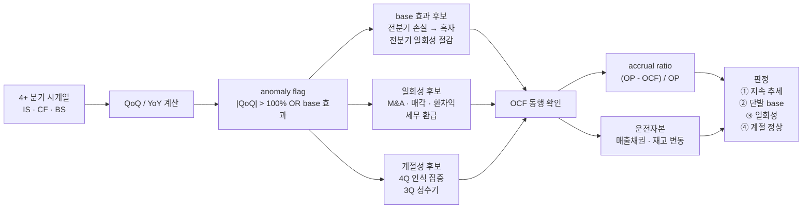

## 공개 호출 방식

```python
import dartlab
import polars as pl

target = "207940"
c = dartlab.Company(target)

statements = {}
for topic in ["IS", "CF", "BS"]:
    statements[topic] = c.show(topic, freq="Q")

def get_value(df, label_substr, period):
    rows = df.filter(pl.col(df.columns[1]).str.contains(label_substr))
    if rows.is_empty() or period not in df.columns:
        return None
    return rows[period][0]

periods = [c for c in statements["IS"].columns if str(c)[:4].isdigit()]
periods_sorted = sorted(periods, reverse=True)[:8]

rows = []
for i, p in enumerate(periods_sorted):
    sales = get_value(statements["IS"], "매출", p)
    op = get_value(statements["IS"], "영업이익", p)
    ocf = get_value(statements["CF"], "영업활동", p)
    receivables = get_value(statements["BS"], "매출채권", p)
    inventories = get_value(statements["BS"], "재고자산", p)
    rows.append({
        "period": p,
        "sales": sales,
        "operating_profit": op,
        "ocf": ocf,
        "receivables": receivables,
        "inventories": inventories,
    })

# QoQ / YoY 계산 + anomaly flag
for i, row in enumerate(rows[:-1]):
    prev = rows[i + 1]
    if row["sales"] and prev["sales"]:
        row["sales_QoQ"] = (row["sales"] - prev["sales"]) / abs(prev["sales"])
    if row["operating_profit"] and prev["operating_profit"]:
        if abs(prev["operating_profit"]) > 1e6:
            row["op_QoQ"] = (row["operating_profit"] - prev["operating_profit"]) / abs(prev["operating_profit"])
    # anomaly flag: QoQ |x| > 100% OR base 효과 (전분기 손실 → 흑자)
    row["anomaly"] = False
    if row.get("sales_QoQ") and abs(row["sales_QoQ"]) > 1.0:
        row["anomaly"] = True
    if prev["operating_profit"] and row["operating_profit"]:
        if prev["operating_profit"] < 0 and row["operating_profit"] > 0:
            row["anomaly"] = True
            row["anomaly_kind"] = "base_effect"

emit_result(
    table=rows[:8],
    values={
        "target": target,
        "periodCount": len(rows),
        "anomalyCount": sum(1 for r in rows if r.get("anomaly")),
    },
    date=periods_sorted[0] if periods_sorted else "latest",
)
```

## 호출 동작 — 5 단 분석 구조

### 1. 결론 도출

*anomaly 분기 식별 + 후보 (base / 일회성 / 계절성) 분리 + 추세 vs 단발 판정* 한 문장 결론.

좋은 결론 예시:
- "207940 (삼성바이오로직스) 2026Q1 매출 1.26조 (QoQ +307%) 는 *4 분기 base 효과* 가능성. 2025Q4 매출 0.31조 = 일회성 인식 지연. CMO 산업 특성상 분기 인식 시점 큼 — 4 분기 추세 (2025Q1·Q2·Q3·Q4·2026Q1) 동반 확인 필요. OCF 동행 검증 보류 [conf:60]."
- "005930 2025Q3 영업이익 +180% QoQ — 전분기 (2025Q2) 6.3% OPM 가 일시 저점, 2025Q3 14.1% 정상화. *base 효과 50% + 메모리 회복 50%*. 매출도 QoQ +15% 동반이라 *지속 추세 시작 [conf:70]*."

금지:
- 단일 분기 QoQ + 단순 % 로 단정.
- OCF 검증 없이 영업이익만 보고 "회복" 판정.
- 일회성 (M&A 매각·환차익·세무 환급) 식별 없이 추세 단정.

### 2. 핵심 근거 수집

`requiredEvidence: skillRef + tableRef + valueRef + dateRef` 필수.

- **skillRef**: `engines.company` (IS/CF/BS), `engines.analysis` (financial / cashflow / sustainability), `recipes.fundamental.quality.earningsQualityCheck` (이익 quality 큰 틀), `recipes.fundamental.quality.workingCapitalQuality` (운전자본 분리).
- **tableRef** (3+ 표):
  1. **4+ 분기 시계열** — period · 매출 · 영업이익 · OCF · 매출채권 · 재고 · QoQ% · YoY%
  2. **anomaly flag** — 분기 · 변동 절대값 · QoQ% · base 효과 / 일회성 / 계절성 / 지속 후보 · confidence
  3. **OCF vs 영업이익 괴리** — 분기 · OP · OCF · 차이 · accrual ratio (OP - OCF) / OP
- **valueRef**: anomaly 분기·QoQ%·OCF 동행 여부·일회성 식별 항목.
- **dateRef**: 분기 시계열 (4~8 분기).

도구 우선순위:
1. `EngineCall("Company.show", topic="IS"/"CF"/"BS", freq="Q")` — 3 statement 분기 시계열
2. `EngineCall("Company.analysis", axis="financial", sub="현금흐름")` — accrual ratio 자동
3. `RunPython` — QoQ/YoY 계산 + anomaly flag + 일회성 분리

### 3. 메커니즘 분석

anomaly 판정 = *변동 크기 임계 + 3 후보 분리 (base / 일회성 / 계절성) + 지속 신호 확인*:



**anomaly 임계** (KR 시장 기준):

| 지표 | 임계 (QoQ) | 의미 |
|---|---|---|
| 매출 | \|QoQ\| > 100% | 산업 평균 분기 변동 매우 초과 |
| 영업이익 | \|QoQ\| > 100% | base 효과 또는 일회성 후보 |
| 영업이익 | 전분기 음수 → 양수 | base 효과 강력 후보 |
| OCF | \|QoQ\| > 50% | 운전자본 또는 시점 차이 |
| 매출채권 / 매출 | 비율 > 30%p 증가 | 매출 인식 vs 회수 시차 |
| 재고 / 매출 | 비율 > 20%p 증가 | 수요 둔화 또는 선수주 |
| 영업이익 - OCF / 영업이익 | > 50% | 발생주의 - 현금주의 큰 괴리 |

**3 후보 분리 신호**:

**base 효과** (Q-1 비정상 → Q 정상화):
- 전분기 영업이익 마이너스, 이번 분기 플러스
- 전분기 일회성 비용 (구조조정·자산상각) → 이번 분기 정상
- 같은 분기 YoY 는 큰 변동 X (전년동기 정상 base)

**일회성** (Q 자체 일회성):
- 자산 매각·M&A·환차익·세무 환급 등 *비영업/비반복* 항목 비중 큼
- 다음 분기 같은 항목 부재
- 영업이익 vs 순이익 괴리 큼 (영업외 손익 큰 영향)

**계절성** (분기마다 반복):
- 같은 분기 YoY 비교 시 변동 X
- 산업 특성 (반도체 4Q peak, 유통 3Q 성수기, CMO·바이오 분기 인식 큼)
- 4 분기 시계열에서 같은 분기 위치 반복

### 4. 반례·한계

- **Falsifier**: 분기 시계열 < 4 또는 IS/CF/BS 1+ 누락 → 판정 불가.
- **base 효과 + 회복 동시 진행**: 분리 X (예 - 전분기 손실 + 산업 회복) → confidence 낮춤.
- **회계 정책 변경**: 매출 인식 기준 변경 (IFRS 16 등) 시 분기 비교 무의미.
- **합병·분할**: 회사 자체 구조 변화 시 분기 시계열 단절. retrospective 조정 확인.
- **계절성 4 분기 부족**: 1 년 (4 분기) 만으론 계절성 vs 추세 구분 약함. 8 분기 권장.
- **OCF 시점 차이**: 매출 인식 vs 현금 회수 시차. 일시적 OCF 마이너스가 *추세 약화* 아닐 수 있음.
- **외부 변수**: 환율·유가 변동이 모든 분기 영향. macro 충격은 별도 분리 (recipes.macro.scenarioSensitivityMatrix).

### 5. 후속 모니터링

| 신호 | 임계 | 의미 / 조치 |
|---|---|---|
| 다음 분기 동일 항목 | 비슷한 +급증 반복 | 지속 추세 확정 |
| 다음 분기 정상 수준 회귀 | QoQ -50%+ | 일회성 확정 |
| 4 분기 같은 분기 비교 | YoY 정상 범위 | 계절성 확정 |
| OCF 동행 회복 | accrual ratio < 30% | 회계 - 현금 동기화 |
| 매출채권·재고 정상화 | 비율 회귀 | 운전자본 정상화 |
| 일회성 항목 공시 | 비영업손익 명시 | 분리 정량화 |

## 대표 반환 형태

- `tableRef:anomaly:quarterly_flow` — 4+ 분기 시계열
- `tableRef:anomaly:flag_summary` — anomaly flag + 후보 분리
- `tableRef:anomaly:cashflow_gap` — OCF vs OP 괴리
- `valueRef:anomaly:largestQoQ` — 최대 변동 분기
- `valueRef:anomaly:accrualRatio` — accrual ratio
- `dateRef:anomaly:periodRange` — 분석 분기 범위

## 연계 절차

- 이익 quality 큰 틀 → `recipes.fundamental.quality.earningsQualityCheck`
- 운전자본 깊이 → `recipes.fundamental.quality.workingCapitalQuality`
- CF 거버넌스 (배당·자사주·환원) → `recipes.fundamental.quality.cashflowGovernanceDualSignal`
- 시장 regime 검증 (분기 변동성 시장 전체 패턴) → `recipes.meta.screen.marketRegimeCheck`
- 회계 forensics (분식 의심) → `recipes.fundamental.quality.forensics.*`

재호출 트리거: "QoQ +300% 의심", "base 효과 분리", "일회성 손익 vs 추세".

## 기본 검증

- 분기 시계열 ≥ 4 분기.
- IS + CF + BS 3 statement 모두 인용.
- anomaly flag 임계 명시.
- 3 후보 (base / 일회성 / 계절성) 분리 시도.
- accrual ratio 또는 OCF/OP 괴리 정량.

## AI 직접 사용 방식

1. `ReadSkill` 에서 *QoQ 급변·anomaly·일회성·base 효과* 질문이면 본 recipe 선정.
2. `Company.show` 3 topic (IS/CF/BS) freq=Q ≥ 4 분기 호출.
3. RunPython 으로 QoQ/YoY 계산 + anomaly flag + accrual ratio.
4. 답변에 *4+ 분기 표 + anomaly 후보 분리 + OCF 괴리* 3 셋 필수.
5. `falsifier.description` — 시계열 부족 시 결론 보류.
