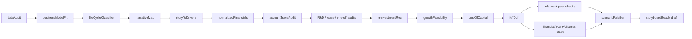

## 공개 호출 방식

AI 도구 실행 순서는 `EngineCall` 우선이다. `Company.panel("IS"|"BS"|"CF")`, `gather.price`, reference lookup, 하위 Damodaran recipe 실행처럼 engine/capability surface 가 있는 입력은 EngineCall 로 먼저 확보한다. 아래 Python 블록은 같은 입력을 `buildDamodaranMemo` 로 묶는 **RunPython fallback** 절차다.

```python
import dartlab
import importlib.resources as resources
import json
from pathlib import Path

import polars as pl
from dartlab.synth.damodaranL15 import buildDamodaranMemo

target = "005930"
c = dartlab.Company(target)
market = getattr(c, "market", "US" if not target.isdigit() else "KR")
currency = getattr(c, "currency", "USD" if market == "US" else "KRW")
company_name = getattr(c, "corpName", getattr(c, "companyName", target))


def _loadReference(name):
    return json.loads(resources.files("dartlab.reference.data").joinpath(name).read_text(encoding="utf-8"))


def _safeShow(topic):
    try:
        table = c.panel(topic, freq="Y")
    except TypeError:
        table = c.panel(topic)
    except Exception:
        return pl.DataFrame()
    return table if isinstance(table, pl.DataFrame) else pl.DataFrame()


def _latestPrice(frame):
    if not isinstance(frame, pl.DataFrame) or frame.height == 0:
        return {}
    date_col = "date" if "date" in frame.columns else "Date" if "Date" in frame.columns else None
    close_col = "close" if "close" in frame.columns else "Close" if "Close" in frame.columns else None
    latest = frame.sort(date_col).tail(1).to_dicts()[0] if date_col else frame.tail(1).to_dicts()[0]
    out = {}
    if close_col and latest.get(close_col) is not None:
        out["price"] = latest.get(close_col)
    if date_col and latest.get(date_col) is not None:
        out["priceDate"] = str(latest.get(date_col))
    return out


def _marketData():
    out = {}
    try:
        price_frame = dartlab.gather("price", target, market="US") if market == "US" else dartlab.gather("price", target)
        out.update(_latestPrice(price_frame))
    except Exception as exc:
        out["priceError"] = type(exc).__name__

    if market == "KR":
        krx_path = Path("data/gov/prices/date/2026.parquet")
        if krx_path.exists():
            try:
                krx = (
                    pl.scan_parquet(str(krx_path))
                    .filter(pl.col("ISU_CD") == target)
                    .select(["BAS_DD", "TDD_CLSPRC", "MKTCAP", "LIST_SHRS"])
                    .sort("BAS_DD")
                    .tail(1)
                    .collect()
                )
                if krx.height:
                    row = krx.to_dicts()[0]
                    out.update(
                        {
                            "price": row.get("TDD_CLSPRC") or out.get("price"),
                            "priceDate": str(row.get("BAS_DD") or out.get("priceDate")),
                            "marketCap": row.get("MKTCAP"),
                            "shares": row.get("LIST_SHRS"),
                        }
                    )
            except Exception as exc:
                out["marketCapError"] = type(exc).__name__

    if market == "US" and out.get("price") is not None:
        cik = str(getattr(c, "cik", "") or "")
        for path in (Path(f"data/edgar/finance/{cik}.parquet"), Path(f"data/edgar/finance/{target}.parquet")):
            if not path.exists():
                continue
            try:
                shares = (
                    pl.scan_parquet(str(path))
                    .filter((pl.col("unit") == "shares") & pl.col("tag").str.contains("SharesOutstanding"))
                    .select(["val", "filed"])
                    .sort("filed")
                    .tail(1)
                    .collect()
                )
                if shares.height:
                    out["shares"] = shares["val"][0]
                    out["marketCap"] = float(out["price"]) * float(out["shares"])
                    break
            except Exception as exc:
                out["marketCapError"] = type(exc).__name__
    return out


country_defaults = _loadReference("damodaranDefaults.json")
industry_defaults = _loadReference("damodaranIndustryDefaults.json")
statements = {topic: _safeShow(topic) for topic in ("IS", "BS", "CF")}
memo = buildDamodaranMemo(
    target=target,
    market=market,
    currency=currency,
    companyName=company_name,
    statements=statements,
    countryDefaults=country_defaults,
    industryDefaults=industry_defaults,
    marketData=_marketData(),
)

emit_result(
    table=memo["tables"]["deepDive"],
    values=memo["headline"],
    date=memo.get("asOf"),
    units=memo["units"],
    sources=memo["sources"],
)
```

## 호출 동작

### 1. 결론 도출

최종 출력은 투자 의견이 아니라 valuation memo다. `valueBand`, `priceImpliedStory`, `breakConditions`, `missingEvidence`, `storyboardReady`를 함께 낸다. 공개 실행 표는 21단계 status table이어야 하며, 각 단계는 `status`, `evidence`, `fallbackCount`, `blockerCount`, `nextAction`을 포함한다.

### 2. 핵심 근거 수집

20개 하위 Damodaran recipe의 결과를 순서대로 묶는다. 모든 숫자는 L1/L1.5 EngineCall 결과 또는 RunPython fallback 이 발급한 `emit_result(...)` evidence 에서 나온다. 공식 승격 후보 검토에서는 `finalDecision.blockerCount == 0` 또는 blocker가 의도된 모델 차단인지 확인해야 한다.

### 3. 메커니즘 분석

데이터 가능성, 모델 적합성, 수명주기, narrative-to-driver, 재무 정규화와 조정 감사, 재투자와 ROC, 성장 가능성, WACC, DCF, 상대가치 검산, 특수상황 경로, reverse DCF 반증을 하나의 인과 흐름으로 묶는다.



### 4. 반례·한계

하위 단계의 `blocked`가 하나라도 있으면 memo는 `incomplete`다. US peer valuation, stale ERP, industry fallback, financial-firm blocker는 빠짐없이 노출한다.

### 5. 후속 모니터링

매출 성장, 정상 마진, reinvestment rate, ROC-WACC spread, terminal value share, reverse DCF 요구 성장률을 다음 분기 모니터링 지표로 남긴다.

## 대표 반환 형태

`damodaranMemo : dict` — `decisionStatus`, `valueBand`, `assumptionTable`, `reverseDcf`, `falsifiers`, `gapLedger`, `storyboardReady`를 담는다. `memo["tables"]["deepDive"]`는 `order`, `step`, `status`, `evidence`, `fallbackCount`, `blockerCount`, `nextAction` 열을 가진 21행 execution status table이다.

## 연계 절차

1. recipes.fundamental.valuation.damodaran.dataAudit - 데이터 가능성.
2. recipes.fundamental.valuation.damodaran.businessModelFit - 모델 적합성.
3. recipes.fundamental.valuation.damodaran.lifeCycleClassifier - 수명주기.
4. recipes.fundamental.valuation.damodaran.narrativeMap - 내러티브 맵.
5. recipes.fundamental.valuation.damodaran.storyToDrivers - 스토리-드라이버 변환.
6. recipes.fundamental.valuation.damodaran.normalizedFinancials - 재무 패널.
7. recipes.fundamental.valuation.damodaran.accountTraceAudit - 계정 trace.
8. recipes.fundamental.valuation.damodaran.rdCapitalization - R&D 자본화 감사.
9. recipes.fundamental.valuation.damodaran.leaseDebtAdjustment - 리스부채 감사.
10. recipes.fundamental.valuation.damodaran.oneOffAdjustment - 일회성 항목 감사.
11. recipes.fundamental.valuation.damodaran.reinvestmentRoc - value driver.
12. recipes.fundamental.valuation.damodaran.growthFeasibility - 성장 가능성 반증.
13. recipes.fundamental.valuation.damodaran.costOfCapital - WACC.
14. recipes.fundamental.valuation.damodaran.fcffDcf - 가치 밴드.
15. recipes.fundamental.valuation.damodaran.relativeCheck - 상대가치 검산.
16. recipes.fundamental.valuation.damodaran.peerMultipleDecomposition - peer multiple 분해.
17. recipes.fundamental.valuation.damodaran.financialFirmExcessReturn - 금융업 경로.
18. recipes.fundamental.valuation.damodaran.sumOfParts - SOTP 경로.
19. recipes.fundamental.valuation.damodaran.distressAdjustedDcf - distress 경로.
20. recipes.fundamental.valuation.damodaran.scenarioFalsifier - reverse DCF 반증.

## 기본 검증

- 5개 고정 타깃에서 self-run 표를 남긴다.
- KR+US 각 1개 이상 full path 또는 fallback path 성공이 있어야 한다.
- 엔진에 있는 Company/gather/reference 입력을 RunPython 코드로 재구현하지 않는다. RunPython 은 `buildDamodaranMemo` 결합 fallback 으로만 사용한다.
- visualRefs 는 observed viz skill 만 포함해야 하며, DCF/가격/재무구조 차트는 tableRef/valueRef/dateRef/evidenceBinding 이 없으면 만들지 않는다.
- L2 금지 정적 검사와 `strict-l0-l15` guard를 통과하기 전에는 complete 선언 금지.
- deepDive execution status table은 21행이어야 하며 finalDecision과 scenarioFalsifier를 포함해야 한다.
- verified/curated 승격은 ValidateRecipe scorecard와 운영자 승격 절차 이후에만 가능하다.
