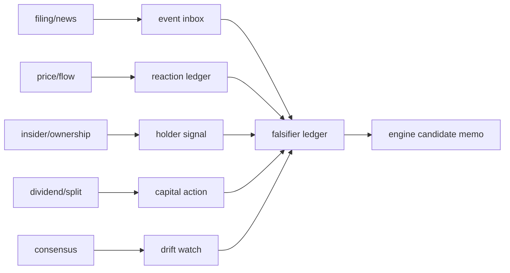

## 공개 호출 방식

AI 도구 실행 순서는 `EngineCall` 우선이다. `Company.disclosure`, `Company.liveFilings`, `Company.gather`, `scan.market`, `scan.insider`, `scan.capital`은 엔진 surface로 호출한다. 아래 Python 블록은 확보한 L1/L1.5 근거를 `buildEventRadarMemo`로 묶는 **RunPython fallback** 절차다.

```python
import dartlab
from dartlab.synth.eventRadar import buildEventRadarMemo

target = "005930"
c = dartlab.Company(target)

def rows(value, limit=30):
    if hasattr(value, "head") and hasattr(value, "to_dicts"):
        return value.head(limit).to_dicts()
    if isinstance(value, list):
        return value[:limit]
    return []

def gather_rows(axis, limit=30):
    try:
        return rows(c.gather(axis), limit=limit)
    except Exception:
        try:
            return rows(dartlab.gather(axis, target=target), limit=limit)
        except Exception:
            return []

try:
    filings = rows(c.disclosure(days=45), limit=50)
except TypeError:
    filings = rows(c.disclosure(), limit=50)
except Exception:
    filings = []

try:
    live_filings = rows(c.liveFilings(days=7), limit=20)
except Exception:
    live_filings = []

memo = buildEventRadarMemo(
    target=target,
    market=str(getattr(c, "market", "KR")),
    companyName=str(getattr(c, "corpName", target)),
    filings=[*live_filings, *filings],
    newsRows=gather_rows("news", limit=20),
    priceRows=gather_rows("price", limit=40),
    flowRows=gather_rows("flow", limit=40),
    insiderRows=gather_rows("insiderTrading", limit=20),
    ownershipRows=gather_rows("ownership", limit=20),
    dividendRows=gather_rows("dividends", limit=20),
    splitRows=gather_rows("splits", limit=20),
    consensusRows=gather_rows("consensus", limit=12),
)

emit_result(
    table=memo["tables"]["deepDive"],
    values=memo["headline"],
    date=memo["asOf"],
    sources=memo["sources"],
)
```

## 호출 동작

### 1. 결론 도출

`radarScore`, `eventCount`, `openFalsifierCount`, `decisionStatus`를 뽑는다. 점수는 이벤트 강도와 반응의 우선순위이지 매수·매도 결론이 아니다.

### 2. 핵심 근거 수집

근거는 filing/news/price/flow/insider/ownership/dividend/split/consensus/scan primitive row에서만 나온다. 답변에는 target, date, sourceRef, tableRef, valueRef, executionRef가 있어야 한다.

### 3. 메커니즘 분석



### 4. 반례·한계

정기 공시, 중복 기사, 시장 전체 변동, stale consensus, 계획 매도, 기계적 배당·분할은 반드시 falsifier로 남긴다.

### 5. 후속 모니터링

3개 이상 target selfRun에서 반복되고, falsifier가 닫히며, observed viz binding이 안정되면 engineCandidateMemo에 승격 후보로 남긴다.

## 대표 반환 형태

`memo : dict`

| key | 의미 |
|---|---|
| `headline` | target, radarScore, eventCount, openFalsifierCount, decisionStatus |
| `tables.sourceCoverageAudit` | 입력 source별 row coverage |
| `tables.eventInbox` | 공시·뉴스 이벤트 분류 |
| `tables.priceFlowReaction` | 가격·거래량·수급 반응 |
| `tables.insiderOwnershipSignal` | 내부자·주요주주 변화 |
| `tables.capitalActionMonitor` | 배당·분할·자사주·증자 이벤트 |
| `tables.consensusDriftWatch` | 컨센서스 변화 |
| `tables.falsifierLedger` | 반증 조건 |
| `tables.engineCandidateMemo` | 엔진 환류 후보 |
| `tables.visualDecisionPack` | observed viz 선택 |

## 연계 절차

1. recipes.incubator.eventRadar.sourceCoverageAudit - 원자료 coverage 확인.
2. recipes.incubator.eventRadar.eventInbox - 공시·뉴스 이벤트 분류.
3. recipes.incubator.eventRadar.priceFlowReaction - 가격·거래량·수급 반응.
4. recipes.incubator.eventRadar.insiderOwnershipSignal - 내부자·주요주주 변화.
5. recipes.incubator.eventRadar.capitalActionMonitor - 배당·분할·자사주·증자 이벤트.
6. recipes.incubator.eventRadar.consensusDriftWatch - 컨센서스 변화.
7. recipes.incubator.eventRadar.falsifierLedger - 반증 ledger.
8. recipes.incubator.eventRadar.engineCandidateMemo - 엔진 환류 후보.
9. recipes.incubator.eventRadar.visualDecisionPack - observed viz 선택.
10. recipes.incubator.eventRadar.deepDive - 전체 실행.

## 기본 검증

- 공개 호출 블록에 L2/L3 호출 문자열이 없어야 한다.
- RunPython은 `buildEventRadarMemo` 결합과 `emit_result(...)` 발급에만 쓴다.
- visualRefs는 observed 상태의 viz skill만 포함한다.
- `deepDive`, `falsifierLedger`, `engineCandidateMemo`, `visualDecisionPack`이 모두 있어야 한다.
