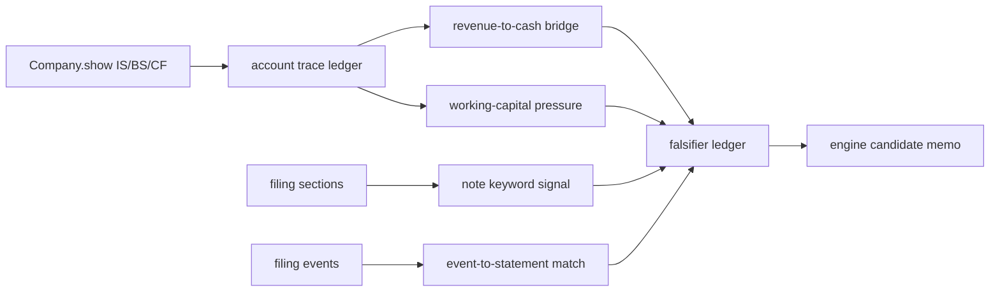

## 공개 호출 방식

```python
import dartlab
from dartlab.synth.evidenceForensics import buildEvidenceForensicsMemo

target = "005930"
c = dartlab.Company(target)
statements = {}
for topic in ("IS", "BS", "CF"):
    try:
        statements[topic] = c.show(topic, freq="Y")
    except TypeError:
        statements[topic] = c.show(topic)
    except Exception:
        pass

sectionTexts = {}
for topic in ("businessOverview", "riskFactors", "mdna", "notesDetail"):
    try:
        sectionTexts[topic] = str(c.show(topic))[:20000]
    except Exception:
        pass

memo = buildEvidenceForensicsMemo(
    target=target,
    market=str(getattr(c, "market", "KR")),
    companyName=str(getattr(c, "corpName", target)),
    statements=statements,
    sectionTexts=sectionTexts,
)

emit_result(
    table=memo["tables"]["deepDive"],
    values=memo["headline"],
    date=memo["asOf"],
    sources=memo["sources"],
)
```

## 호출 동작

### 1. 결론 도출

이 진입점은 투자 결론을 만들지 않는다. 대신 `riskScore`, `signalCount`, `candidateCount`, `decisionStatus`를 뽑고, 어떤 세부 skill을 더 읽어야 하는지 결정한다. `riskScore`는 L1/L1.5 신호의 강도일 뿐이며, 위험 단정이 아니다.

### 2. 핵심 근거 수집

근거는 `Company.show("IS"|"BS"|"CF")`, optional section text, optional scan primitive row에서만 나온다. 답변에는 target, period, sourceRef, tableRef, valueRef, dateRef, executionRef가 함께 있어야 한다.

### 3. 메커니즘 분석



### 4. 반례·한계

매출채권·재고·공시 키워드 신호는 모두 false positive가 많다. 계절성, 신규 대형 고객, 수주잔고, M&A, boilerplate 감사 문구, 금융업 계정 구조를 반드시 반증 ledger에 남긴다.

### 5. 후속 모니터링

반복 selfRun에서 같은 신호가 3개 이상 대표 케이스에서 방향성을 보이면 `engineCandidateMemo`에 남기고, ask 답변 품질이 두 번 이상 통과할 때만 L2 축 승격 후보로 본다. 승격 후에도 이 recipe는 원표 기반 검산 경로로 계속 사용한다.

## 대표 반환 형태

`memo : dict` 구조:

| key | 의미 |
|---|---|
| `headline` | target, riskScore, signalCount, candidateCount, decisionStatus |
| `tables.dataCoverageAudit` | 원표와 metric coverage |
| `tables.accountTraceLedger` | 표준 metric이 어떤 원표 row에 매핑됐는지 |
| `tables.revenueToCashBridge` | 매출·채권·CFO 괴리 |
| `tables.workingCapitalPressureMap` | DSO/DIO/DPO/CCC와 재고 gap |
| `tables.noteSignalExtractor` | 공시 섹션 키워드 신호 |
| `tables.eventToStatementMatcher` | 이벤트와 재무 압력 연결 |
| `tables.falsifierLedger` | 신호별 반증 조건 |
| `tables.engineCandidateMemo` | 엔진 환류 후보 |

## 연계 절차

1. recipes.incubator.forensics.dataCoverageAudit - 원표와 metric coverage를 먼저 확인한다.
2. recipes.incubator.forensics.accountTraceLedger - 핵심 metric이 어떤 raw 계정에서 왔는지 추적한다.
3. recipes.incubator.forensics.revenueToCashBridge - 매출 증가와 현금 회수의 괴리를 본다.
4. recipes.incubator.forensics.workingCapitalPressureMap - 운전자본 압력과 CCC를 계산한다.
5. recipes.incubator.forensics.noteSignalExtractor - 주석·사업보고서 원문 키워드 신호를 추출한다.
6. recipes.incubator.forensics.eventToStatementMatcher - 이벤트 공시와 재무제표 변동을 매칭한다.
7. recipes.incubator.forensics.crossSectionAnomalyRank - scan primitive 기반 횡단면 이상치를 확인한다.
8. recipes.incubator.forensics.falsifierLedger - 반증 조건을 열어 결론 과잉을 막는다.
9. recipes.incubator.forensics.engineCandidateMemo - 반복 가능한 신호를 엔진 후보로 정리한다.
10. recipes.incubator.forensics.deepDive - 위 단계를 한 번에 실행한다.

## 기본 검증

- 공개 호출 블록에 L2/L3 호출 문자열이 없어야 한다.
- `buildEvidenceForensicsMemo` 결과에는 10개 table이 모두 있어야 한다.
- ask가 `포렌식 팩`, `L1.5 회계 검증`, `analysis 없이` 질문에서 이 스킬을 상위 후보로 찾아야 한다.
- 신호가 있어도 `falsifierLedger`가 없으면 답변 품질 실패로 본다.
