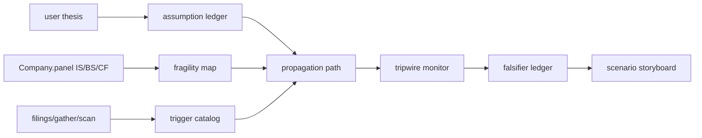

## 공개 호출 방식

AI 도구 실행 순서는 `EngineCall` 우선이다. `Company.panel`, `Company.disclosure`, `Company.gather`, `scan.market`, `scan.audit`, `scan.quality`는 엔진 surface로 호출한다. 아래 Python 블록은 확보한 L1/L1.5 근거를 `buildThesisKillChainMemo`로 묶는 **RunPython fallback** 절차다.

```python
import dartlab
from dartlab.synth.thesisKillChain import buildThesisKillChainMemo

target = "005930"
thesis = "매출 성장과 현금 전환이 유지되어 valuation discount가 해소된다"
c = dartlab.Company(target)

def rows(value, limit=30):
    if hasattr(value, "head") and hasattr(value, "to_dicts"):
        return value.head(limit).to_dicts()
    if isinstance(value, list):
        return value[:limit]
    return []

def gather_rows(axis, limit=30):
    try:
        return rows(c.gather(axis), limit=limit)
    except Exception:
        try:
            return rows(dartlab.gather(axis, target=target), limit=limit)
        except Exception:
            return []

statements = {}
for topic in ("IS", "BS", "CF"):
    try:
        statements[topic] = c.panel(topic, freq="Y")
    except TypeError:
        statements[topic] = c.panel(topic)
    except Exception:
        pass

try:
    filings = rows(c.disclosure(), limit=50)
except Exception:
    filings = []

memo = buildThesisKillChainMemo(
    target=target,
    thesis=thesis,
    market=str(getattr(c, "market", "KR")),
    companyName=str(getattr(c, "corpName", target)),
    statements=statements,
    filings=filings,
    priceRows=gather_rows("price", limit=40),
    flowRows=gather_rows("flow", limit=40),
    consensusRows=gather_rows("consensus", limit=12),
)

emit_result(
    table=memo["tables"]["deepDive"],
    values=memo["headline"],
    date=memo["asOf"],
    sources=memo["sources"],
)
```

## 호출 동작

### 1. 결론 도출

`killRiskScore`, `assumptionCount`, `openTripwireCount`, `openFalsifierCount`, `decisionStatus`를 반환한다. 이 값은 thesis를 확정하는 점수가 아니라, 깨지는 경로가 얼마나 열려 있는지 보는 우선순위다.

### 2. 핵심 근거 수집

근거는 사용자 thesis, 명시 assumption, IS/BS/CF 원표, filings, price/flow/consensus, optional scan primitive에서만 나온다. 답변에는 target, date, tableRef, valueRef, sourceRef, executionRef가 있어야 한다.

### 3. 메커니즘 분석



### 4. 반례·한계

kill-chain은 반증 시나리오다. 반증 조건이 닫히면 thesis는 유지될 수 있다. 계절성, 일회성 현금흐름, 시장 전체 움직임, stale consensus, 정기 공시는 반드시 counter-evidence로 남긴다.

### 5. 후속 모니터링

tripwire가 watch/risk로 바뀌면 같은 helper를 다시 실행한다. 사용자는 “thesis가 맞나?”보다 “어떤 tripwire가 먼저 깨졌나?”를 확인한다.

## 대표 반환 형태

`memo : dict`

| key | 의미 |
|---|---|
| `headline` | killRiskScore, premortemQualityScore, qualityGateStatus, openTripwireCount, openFalsifierCount |
| `tables.thesisIntake` | 사용자 thesis와 파싱된 theme |
| `tables.assumptionLedger` | testable assumption |
| `tables.fragilityMap` | 원자료 취약 지표 |
| `tables.triggerCatalog` | thesis를 흔드는 촉발 조건 |
| `tables.propagationPath` | trigger → mechanism → assumption |
| `tables.tripwireMonitor` | 임계값과 현재 상태 |
| `tables.falsifierLedger` | 반증 조건 |
| `tables.scenarioStoryboard` | base/erosion/kill-chain 시나리오 |
| `tables.premortemQualityGate` | 최종 답변 차단 gate |

## 타협 없는 사용 기준

- `qualityGateStatus == "flagshipReady"`가 아니면 thesis를 방어하는 결론으로 가지 않는다.
- `premortemQualityGate`의 risk row는 최종 답변 앞부분에 그대로 드러낸다.
- sourceBreadth, propagationConnected, falsifierOpen 중 하나라도 risk면 다음 EngineCall/RunPython 보강 절차가 답변의 결론이다.
- 시각화는 `visualDecisionPack`이 ready인 observed viz만 사용한다.

## 연계 절차

1. recipes.meta.thesisKillChain.thesisIntake - thesis를 입력하고 theme을 파싱.
2. recipes.meta.thesisKillChain.evidenceCoverageAudit - 원자료 coverage 확인.
3. recipes.meta.thesisKillChain.assumptionLedger - 가정을 testable row로 분해.
4. recipes.meta.thesisKillChain.fragilityMap - 원표·시장·기대 취약성 계산.
5. recipes.meta.thesisKillChain.triggerCatalog - 촉발 조건 정리.
6. recipes.meta.thesisKillChain.propagationPath - 깨지는 전파 경로 구성.
7. recipes.meta.thesisKillChain.tripwireMonitor - 임계와 current 상태 확인.
8. recipes.meta.thesisKillChain.falsifierLedger - counter-evidence 열기.
9. recipes.meta.thesisKillChain.scenarioStoryboard - pre-mortem 시나리오 작성.
10. recipes.meta.thesisKillChain.visualDecisionPack - observed viz 선택.
11. recipes.meta.thesisKillChain.premortemQualityGate - 약한 결론 차단.
12. recipes.meta.thesisKillChain.deepDive - 전체 실행.

## 기본 검증

- 공개 호출 블록에 L2/L3 호출 문자열이 없어야 한다.
- `buildThesisKillChainMemo` 결과에는 12개 table이 모두 있어야 한다.
- scenarioStoryboard는 baseIntact, erosionCase, killChainCase를 모두 포함해야 한다.
- premortemQualityGate가 weak이면 `decisionStatus`는 usable이면 안 된다.
- 답변은 propagationPath와 falsifierLedger 없이 thesis 결론을 쓰면 실패다.
