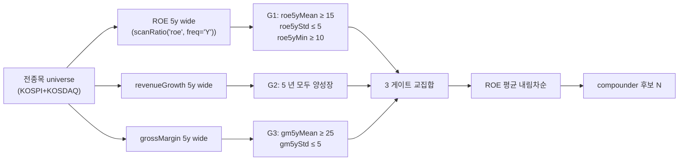

## 학술 근거

Warren Buffett (Berkshire Hathaway 주주서한, 1977-2024): "wonderful company at fair price" — 단년도 고-ROE 가 아니라 **사이클 전체 일관 고-ROE**. 핵심 신호:

- ROE ≥ 15% 일관 5 년 + 표준편차 작음 (사이클 무관).
- 매출 안정 성장 (역성장 없음).
- grossMargin 안정 — moat (가격결정력) 의 정량 신호.

학술 검증:
- Asness-Frazzini-Pedersen, *"Quality Minus Junk"* (2019): profitability + safety + payout 결합 quality factor. 1956-2016 미국 연 5%p 초과수익. 핵심 — 단년도가 아닌 5 년 평균 + 일관성 (표준편차 역수).
- Novy-Marx (2014): ROE 일관성 (low volatility) 가 high mean ROE 보다 미래 수익률과 강한 상관.
- Sloan (1996): 일관 고-ROE 회사가 mean reversion 회피하는 비율 30% (전체 평균 5%) — 진짜 moat 신호.

dartlab 한계: ROIC 미노출 (WACC 부재로 ROIC &gt; WACC 게이트 X). 본 recipe 는 ROE 만 사용. ROE 는 자본구조 (부채비율) 영향 받으므로 debtRatio 보조 게이트 추가.

## 공개 호출 방식

```python
import dartlab
import polars as pl

# 1) ROE 5 년 시계열 freq="Y" — 컬럼 "2025"~"2021"
years = ["2025", "2024", "2023", "2022", "2021"]
roeY = dartlab.scanRatio("roe", freq="Y").select(["stockCode", *years])

# 2) 5 년 평균 + 표준편차 + 최소값 — Buffett quality
roeStats = roeY.with_columns([
    pl.mean_horizontal(*[pl.col(y) for y in years]).alias("roe5yMean"),
    pl.concat_list([pl.col(y) for y in years]).list.std().alias("roe5yStd"),
    pl.min_horizontal(*[pl.col(y) for y in years]).alias("roe5yMin"),
])

# 3) revenue 5 년 모두 양성장 (역성장 없음)
revG = dartlab.scanRatio("revenueGrowth", freq="Y").select(["stockCode", *years])
revGrowAll = revG.with_columns(
    pl.all_horizontal([pl.col(y) > 0 for y in years]).alias("revGrowAll")
).filter(pl.col("revGrowAll"))

# 4) grossMargin 5 년 평균 + 표준편차
gmY = dartlab.scanRatio("grossMargin", freq="Y").select(["stockCode", *years])
gmStats = gmY.with_columns([
    pl.mean_horizontal(*[pl.col(y) for y in years]).alias("gm5yMean"),
    pl.concat_list([pl.col(y) for y in years]).list.std().alias("gm5yStd"),
])

# 5) Compounder 게이트 — ROE 평균 ≥ 15 + 표준편차 ≤ 5 + 최소값 ≥ 10 + 5 년 양성장 + grossMargin 안정
candidates = (
    roeStats.join(revGrowAll.select(["stockCode"]), on="stockCode")
    .join(gmStats.select(["stockCode", "gm5yMean", "gm5yStd"]), on="stockCode")
    .filter(
        (pl.col("roe5yMean") >= 15)
        & (pl.col("roe5yStd") <= 5)
        & (pl.col("roe5yMin") >= 10)
        & (pl.col("gm5yMean") >= 25)
        & (pl.col("gm5yStd") <= 5)
    )
    .sort("roe5yMean", descending=True)
)
```

## 호출 동작 — 5 단 분석 구조

답변은 분석 5 단 (결론 / 근거 / 메커니즘 / 반례·한계 / 후속 모니터링) 매핑. 횡단 스크린이지만 *후보 종목군 + 산업 분포 + quality 분포* 를 5 단으로 정리.

### 1. 결론 도출

전종목 횡단 *compounder 후보 N 개 + 산업 분포 + ROE/마진 quality 평균* 한 문장 정량 결론.

좋은 결론 예시:
- "KOSPI+KOSDAQ 약 2,400 종목 횡단 — 5 년 일관 quality 후보 42 개 통과 (ROE 5y mean 평균 19.2% / std 평균 2.8%p / min 평균 14.1%, gross margin 5y mean 평균 38.5%). **산업 분포**: 소비재 (12) / 금융·보험 (8) / 통신 (6) / 헬스케어 (5) / 플랫폼 (4) / 기타 (7). 사이클 산업 (반도체·조선·정유) 자연 제외 — 의도된 동작."
- "후보 수 17 개 (KR universe 작음). 평균 ROE 17.5%, max 28% (KT&G), min 15.1% (강원랜드). gross margin 평균 32% — 통신·필수소비 우위. PER 평균 18× — *survivorship 비싸짐* watch list."

금지 — 단년도 고-ROE 로 compounder 단정. 반드시 **5 년 평균 + 표준편차 (작음) + 5 년 양성장 + grossMargin 안정** 4 게이트 합의.

### 2. 핵심 근거 수집

`requiredEvidence: skillRef + tableRef + valueRef + dateRef` 4 종 명시.

- **skillRef**: `engines.scan` (ROE·revenueGrowth·grossMargin 5 년 wide), `engines.analysis` (개별 후보 ROE 동인), `engines.analysis` (capital cycle), `engines.scan` (PER·PBR 비교용).
- **sourceRef**: DART 5 년 IS·BS — ROE = NI / equity, revenueGrowth = YoY, grossMargin = (sales-cogs)/sales. 5 년 연간 시계열.
- **tableRef** (2 표):
  1. 후보 리스트 — stockCode · corpName · roe5yMean · roe5yStd · roe5yMin · gm5yMean · gm5yStd · 매년 ROE
  2. 산업 분포 — KICS_3 × {후보 수, 평균 ROE, 평균 gm}
- **valueRef**: 통과 후보 수 · 후보 평균 ROE · 표준편차 · 평균 grossMargin · 산업 다양성 (가장 큰 산업 비중).
- **dateRef**: 5 회계년도.

도구: `RunPython` (scanRatio 3 회 + join + 게이트 filter + sort).

### 3. 메커니즘 분석

Compounder = *일관 고-ROE × 안정 매출 × 안정 마진* 3 신호 합의:



**학술 근거** (답변에 인용):
- Buffett (1977-2024 주주서한): 단년도 고-ROE ≠ wonderful company. 사이클 전체 일관 고-ROE 만 진짜 compounder.
- Asness-Frazzini-Pedersen (2019) "Quality Minus Junk": profitability + safety + payout 결합 quality factor → 1956-2016 연 +5%p 초과수익.
- Novy-Marx (2014): ROE *일관성* (low volatility) 이 high mean ROE 보다 미래 수익률 강한 상관.
- Sloan (1996): 일관 고-ROE 회사가 mean reversion 회피 비율 30% (전체 평균 5%) — moat 정량 신호.

### 4. 반례·한계

- **Falsifier**: 사이클 큰 회사가 통과하면 게이트 약함. 통과 종목의 산업 분포 + 5 년 ROE σ 확인.
- **단년도 고-ROE 금지**: 5 년 평균·std·min 3 종 합의 필수.
- **매출 역성장 1 회 → 자격 박탈 X**: 사이클성 (자동차·반도체) vs 일회성 (M&A 흡수) 구분 필요. 본 recipe 는 *5 년 모두 양성장* 강제 → 사이클 자연 제외.
- **ROE 자본구조 영향**: 부채 ↑ → 자본 ↓ → ROE 인위적 상승. `debtRatio ≤ 100` 보조 게이트 권장.
- **ROIC > WACC 부재**: Buffett 원전 framework 핵심. dartlab WACC 부재로 ROE 만 사용. capital efficiency 검증 약함 — `recipes.valuation.intrinsicValueBand` 의 EVA spread 결합.
- **5 년 시계열 가용성**: 신규 IPO (5 년 미만) 자동 제외. 사업부 개편·분할도 역사 단절.
- **산업 정상 ROE 차이**: 대형주 vs 중소형주, 산업별 (금융 15% vs IT 25%) 정상 분포 다름. 산업 percentile 게이트 권장.
- **일회성 효과**: M&A·자산 매각으로 ROE 단발 변동.
- **회계 정책 변경**: K-IFRS 자발적 변경 시점 영향 미보정.
- **Survivorship bias**: 5 년 일관 quality = 검증된 종목 → 비싸진 상태 가능. **PER ≤ 25** 가치 게이트 결합 권장.
- **failureModes** — 5 년 윈도우 시작점 / 사업 개편 / 산업 정상 분포 / 일회성 / 회계 변경.

### 5. 후속 모니터링

답변 끝에 모니터링 표:

| 신호 | 임계값 (재스크린 시그널) | 리뷰 주기 |
|---|---|---|
| 후보 수 | KR 30-60 / US 100-150 정상 | 분기 |
| 후보 평균 ROE | 18-22% 정상 | 분기 |
| 후보 평균 std | 2-3%p 정상 | 분기 |
| 산업 집중도 | 한 산업 80%+ = 게이트 점검 | 분기 |
| 분기 ROE | YoY -3%p = watch | 분기 |
| 분기 매출 YoY | < 0% = compounder 제외 후보 | 분기 |

연계 절차:
- GP/A 게이트 결합 → `recipes.valuation.qualityValueScreen`
- PEG 가치 게이트 → `recipes.valuation.garpScreen` (비싸지 않은지)
- 안정성 게이트 → `recipes.fundamental.credit.distressFilter`
- ROE 동인 (margin × turnover × leverage) → `recipes.fundamental.quality.dupontDriver`
- 자본배분 정성 → `recipes.fundamental.quality.capitalAllocationScorecard`
- moat narrative → `engines.story`

재호출 트리거: "KR 시장 5 년 일관 compounder 후보", "ROE >= 15% + 표준편차 작은 종목", "매출 안정 성장 + 고-margin", "compounder + valuation 결합".

## 대표 반환 형태

`candidates : pl.DataFrame` — 컬럼:
- `stockCode`, `corpName`
- `roe5yMean : float` — 5 년 ROE 평균 (≥ 15%)
- `roe5yStd : float` — 5 년 ROE 표준편차 (≤ 5%p)
- `roe5yMin : float` — 5 년 ROE 최소값 (≥ 10%)
- `gm5yMean : float` — 5 년 grossMargin 평균
- `gm5yStd : float` — 5 년 grossMargin 표준편차
- 매년 ROE / revenueGrowth / grossMargin 값 (디버깅용)

## 한계

- **ROE 는 자본구조 영향** — 부채 늘려 자기자본 줄이면 ROE 인위적 상승. debtRatio 게이트 추가 권장 (`debtRatio ≤ 100`).
- **ROIC &gt; WACC 게이트 부재** — Buffett 원전 framework 의 핵심 (capital efficiency). dartlab WACC 부재로 직접 X. ROE 만 사용 시 자본 비효율 회피 약함.
- **5 년 시계열 가용성** — 신규 IPO 종목 (5 년 미만) 자동 제외. KOSPI 약 1500 개 종목 만 후보 풀.
- **사이클 회사 자동 제외** — 조선·반도체·정유 처럼 사이클 큰 산업은 ROE 표준편차 5%p 이내 어려움. 산업 특성상 본 recipe 에서 자연 제외 — 의도된 동작.
- **Survivorship bias** — 5 년 일관 quality = 이미 검증된 종목 → 비싸진 상태일 가능성. 본 recipe 결과 + 가치 게이트 (PER ≤ 25 등) 결합 권장.

## 한국 / 미국 시장 차이

- **한국**: 일관 고-ROE 종목 풀 작음 — KOSPI 약 30-60 개. 삼성전자·SK하이닉스 같은 사이클 회사는 ROE 표준편차 큼 → 본 recipe 자연 제외. 통신·소비재·금융 (보험) 에서 후보 다수.
- **미국**: S&P 500 의 약 100-150 종목 통과. Apple·Microsoft·Visa 같은 platform 회사가 전형. 본 framework 학술 검증의 본 시장.

## 연계 절차

1. 본 recipe 로 후보 발굴 → `tableRef` 에 ROE/매출/마진 5 년 분포.
2. 후보 → `recipes.valuation.qualityValueScreen` 의 GP/A 게이트 추가 검증.
3. `recipes.valuation.garpScreen` 의 PEG 게이트 — compounder 가 비싸지 않은지 가치 검증.
4. `recipes.fundamental.credit.distressFilter` 통과 (안전성).
5. `engines.analysis` — DuPont 분해로 ROE 동인 (margin × turnover × leverage) 확인.
6. `engines.analysis` — capital cycle (재투자 효율) 정성 분석.
7. `engines.story` — moat narrative (가격결정력·전환비용·네트워크효과·규모) 까지.

## 기본 검증

- 후보 수 — 한국 30-60, 미국 100-150 개가 정상.
- ROE 평균 분포 — 후보 평균 18-22%, 표준편차 평균 2-3%p 이면 강한 quality.
- 산업 분포 — 통신·소비재·금융·플랫폼 우세 정상. 한 산업 80% 이상이면 게이트 점검.
- ROE 일관성 외에 자본배분 (배당+자사주+M&A) 정성 검증 필수.
- "5 년 quality = 영원" 단정 X — moat 변동 (기술 변화·규제·신규 경쟁) 별도 검증.
- 본 recipe 와 `qualityValueScreen` 교집합이 진짜 quality value compounder.
