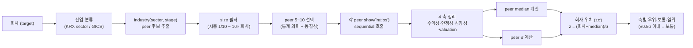

## 공개 호출 방식

```python
import dartlab
import polars as pl

target = "005930"
c = dartlab.Company(target)

def latest_period(df):
    if hasattr(df, "columns"):
        for col in df.columns:
            if str(col)[:4].isdigit():
                return str(col)
    return "latest"

def compact(obj):
    if isinstance(obj, pl.DataFrame):
        return {"type": "DataFrame", "rows": obj.height, "columns": obj.width}
    if isinstance(obj, dict):
        return {"type": "dict", "keys": list(obj.keys())[:8]}
    return {"type": type(obj).__name__}

peer_comparison = c.analysis("peerComparison")
valuation = c.analysis("valuation")
bs = c.show("BS", freq="Y")
peer_rows = [{
    "target": target,
    "peerComparison": compact(peer_comparison),
    "valuation": compact(valuation),
}]

emit_result(
    table=peer_rows,
    values={"target": target, "peerCount": len(peer_rows), "hasPeerComparison": True, "hasValuation": True},
    date=latest_period(bs),
)
```

## 호출 동작 — 5 단 분석 구조

답변은 분석 5 단 (결론 / 근거 / 메커니즘 / 반례·한계 / 후속 모니터링) 매핑. 4 축 (수익성·안정성·성장성·valuation) peer 횡단 결과를 5 단으로 정리.

### 1. 결론 도출

회사의 *peer 평균 대비 위치 (±σ) + 우위 축 + 열위 축* 한 문장 정량 결론.

좋은 결론 예시:
- "005930 (삼성전자) vs 메모리 반도체 peer 5 (SK하이닉스·마이크론·키옥시아·웨스턴디지털·인텔) — **수익성 우위 (+1.2σ)** ROE 14.8% vs peer median 9.2%, **valuation 우위 (-0.8σ)** PER 11.2× vs peer median 14.5×, **성장성 보통** (revenue YoY +12% vs +10% median), **안정성 우위 (+1.5σ)** 부채비율 35% vs peer median 58%. **3/4 축 우위** — 동종 대비 강한 quality + 저평가."
- "027410 (BGF리테일) vs 편의점 peer 3 (GS25·세븐일레븐·이마트24) — **수익성 보통** (ROE 11.5% vs median 11.2%), **안정성 열위 (-1.2σ)** 부채비율 145% vs median 82%, **성장성 보통**, **valuation 열위 (+1.5σ)** PER 18× vs median 13×. **2/4 축 열위** — peer 대비 약점 확인 필요."

금지 — peer median 대비 위치 (±σ) 명시 없이 "우위/열위" 단정. 반드시 *4 축 모두 정량 비교* 동반.

### 2. 핵심 근거 수집

`requiredEvidence: skillRef + tableRef + dateRef` 3 종 명시.

- **skillRef**: `engines.industry` (산업 분류 + peer 추출), `engines.analysis.peerComparison` (횡단 비교), `engines.scan` (peer ratio 일괄 대안 path), `engines.company.show` (각 peer 개별 ratios).
- **sourceRef**: DART/EDGAR 공시 — *같은 분기* + *같은 회계 기준 (연결)* peer 재무. KRX 산업분류 (`sector`) 또는 GICS sub-industry.
- **tableRef** (1+5 표):
  1. 회사 + 5 peer 종합 — code × {수익성 ROE·ROA·OPM, 안정성 부채비율·ICR, 성장성 revenue YoY·EPS YoY, valuation PER·PBR·EV/EBITDA}
  2. ±σ 위치 — 회사가 4 축 각각 peer median ±σ 어디인지
- **dateRef**: 비교 기준 분기 (예: 2025-09-30) — *peer 동일 분기* 필수.

도구: `RunPython` (industry 추출 + sequential peer Company 호출 + 횡단 join + ±σ 계산).

### 3. 메커니즘 분석

Peer benchmark = *같은 산업 + 같은 시점 + 정확한 4 축 비교*:



**4 축 정의** (답변에 명시):
- **수익성** — ROE · ROA · OPM (Operating Profit Margin)
- **안정성** — 부채비율 · 이자보상배율 (ICR) · 유동비율
- **성장성** — revenue YoY · EPS YoY (3년 CAGR 동반 권장)
- **valuation** — PER · PBR · EV/EBITDA · 배당수익률

**±σ 위치** 해석:
- > +1σ = 강한 우위 (수익성·안정성·성장성 양 / valuation 저평가)
- +0.5σ ~ +1σ = 약한 우위
- ±0.5σ = 보통
- < -0.5σ = 열위

**peer 추출 휴리스틱**:
- 같은 산업 (`sector` 또는 GICS sub-industry)
- 시총 1/10 ~ 10 배 (size bucket)
- 같은 stage (성장기/성숙기/쇠퇴기)

### 4. 반례·한계

- **Falsifier**: peer 5 미만이면 통계 의미 X — 후보 부족 명시 + 산업 평균으로 fallback.
- **산업 동질성 모호**: KRX/GICS 분류와 실제 사업 동질성 차이. 예 — "전자장비" 안에 반도체 메모리·비메모리·디스플레이 섞임. sub-segment 확인 필수.
- **시총 격차 큼**: 1 조 vs 10 조 peer 비교 시 valuation·성장성 왜곡. 같은 size bucket (1/10~10×) 권장.
- **분기·회계 기준 정렬 필수**: 다른 분기 (Q3 vs Q4) 또는 연결 vs 별도 섞이면 비교 무의미.
- **통화 정렬**: KRW vs USD peer 비교 시 환율 보정 필요. 시총·EV 같은 절대값.
- **일회성 손익 미보정**: M&A·매각 한 peer 만 영향 → 평균 왜곡. 일회성 제외 후 비교 권장.
- **외화 매출 비중 차이**: 수출 peer (90%) vs 내수 peer (10%) 환율 영향 다름. 환율 sensitivity 별도.
- **stage 무시**: 성장기 (revenue +30%) peer 와 성숙기 (+5%) peer 평균 비교 X.
- **failureModes** — 산업 분류 / 시총 격차 / 일회성 / sub-segment / 외화 매출.

### 5. 후속 모니터링

답변 끝에 모니터링 표:

| 축 | 회사 | peer median | ±σ 위치 | 임계값 (재벤치 시그널) | 리뷰 주기 |
|---|---|---|---|---|---|
| ROE | (계산) | (계산) | (계산) | ±0.5σ 이동 | 분기 |
| 부채비율 | (계산) | (계산) | (계산) | ±10%p 이동 | 분기 |
| revenue YoY | (계산) | (계산) | (계산) | ±5%p 이동 | 분기 |
| PER | (계산) | (계산) | (계산) | ±2× 이동 | 주간 |
| peer 변동 (M&A·신규 IPO) | — | — | — | peer 풀 변경 | 사건별 |

## 대표 반환 형태

- `tableRef` — peer 후보 또는 peer 비교 표.
- `valueRef` — target, peerCount, peerComparison 사용 여부.
- `dateRef` — 재무제표 기준 연도 또는 최신 기준일.
- `executionRef` — RunPython 실행 id.

## 연계 절차
- 산업 깊이 분석 → `recipes.screen.industryDeepDive`
- 산업 stage (성장/성숙/쇠퇴) → `recipes.screen.industryStageScreen`
- valuation 깊이 → `recipes.valuation.check`
- quality compounder 후보 → `recipes.screen.compounderCandidates`
- 산업 평균 횡단 → `engines.scan` direct

재호출 트리거: "삼성전자 vs 동종 5 peer 4 축 벤치마크", "4 대 금융지주 ratio 횡단", "산업 평균 대비 ±σ 위치".

## 기본 검증

- `ValidateRecipe(..., capture=False)` 기준으로 공개 호출 블록이 실행되어야 한다.
- `requiredEvidence`의 근거 종류가 모두 반환되어야 한다.
- target을 바꿔도 `Company("005930")` 하드코딩 가정이 남지 않아야 한다.

## AI 직접 사용 방식

1. `ReadSkill` 에서 사용자 질문과 `whenToUse`를 맞춰 이 recipe를 고른다.
2. `GetSkillBody` 로 본문 전체를 읽고 `linkedSkills` 순서대로 먼저 필요한 엔진 skill을 확인한다.
3. `## 공개 호출 방식`의 첫 Python 블록을 target만 바꿔 `ValidateRecipe(..., capture=False)`로 smoke 실행한다.
4. 실행 결과의 `skillRef`, `tableRef`, `valueRef`, `dateRef`, `executionRef` 중 누락된 근거가 있으면 답변을 작성하지 말고 호출 또는 근거 요구를 보강한다.
5. 답변은 결론, 핵심 근거, 메커니즘, 반례·한계, 후속 모니터링 순서로 작성하고 `falsifier.description`이 있으면 반례 단락에서 반드시 확인한다.
