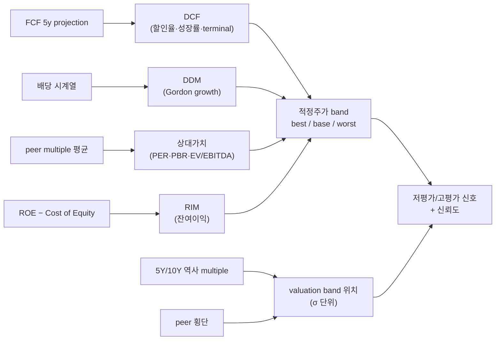

## 공개 호출 방식

```python
import dartlab

c = dartlab.Company("005930")

valuation = c.analysis("valuation", "가치평가")
band = c.analysis("financial", "밸류에이션밴드")
peer_band = dartlab.scan("valuation")
qval = c.quant("가치")
```

## 호출 동작 — 5 단 분석 구조

답변은 분석 5 단 (결론 / 근거 / 메커니즘 / 반례·한계 / 후속 모니터링) 매핑. 4 방법론 (DCF · DDM · 상대가치 · RIM) + valuation band + peer scan 결과를 5 단으로 재배치.

### 1. 결론 도출

회사의 *적정주가 범위 (best/base/worst) + 현재가 위치 + 저평가/고평가 신뢰도* 한 문장 정량 결론.

좋은 결론 예시:
- "005930 (삼성전자) 적정주가 best 95,000 / base 78,000 / worst 62,000 (DCF base 76 / PER 적정 80 / EV/EBITDA 적정 78 / RIM 78), 현재가 71,500 = base -8%. valuation band PER 11.2× = 5 년 평균 14.1× -σ 위치. **base 기준 저평가, 단 신뢰도 보통** (DCF terminal 비중 65%)."
- "OOOOOO best 28,000 / base 22,000 / worst 16,000, 현재가 25,500 = base +16%. PBR 1.8× = 5 년 평균 1.2× +1σ 위치. **base 기준 고평가, 신뢰도 높음** (peer 평균 1.3× 대비 +38% 프리미엄)."

금지 — 단일 값 적정주가 ("78,000 원") 단정. 반드시 **best/base/worst 범위 + 가정 명시 + 신뢰도**.

### 2. 핵심 근거 수집

`requiredEvidence: skillRef + tableRef + valueRef + dateRef` 4 종 명시.

- **skillRef**: `engines.analysis.valuation` (4 방법론), `engines.analysis.valuationBand` (역사 평균 ±σ), `engines.scan.valuation` (peer 횡단), `engines.quant.value` (기술적 가치 신호).
- **sourceRef**: DART 공시 — 5 년 IS/BS/CF (DCF cash flow projection), 배당 시계열 (DDM), 시장가 시계열 (multiple band), peer 회사 valuation snapshot.
- **외부 가정**: 할인율 (KR 8~10% / US 7~9%), terminal 성장률 (1~3%), terminal multiple (12~18× EBITDA). 답변에 가정 명시 + 민감도.
- **tableRef** (3 표):
  1. 4 방법론 종합 — methodology × {best, base, worst}
  2. valuation band 시계열 — quarter × {PER, PBR, EV/EBITDA, 5y mean, ±σ}
  3. peer scan — company × {PER, PBR, EV/EBITDA, market cap, sector phase}
- **valueRef**: DCF base 적정가 / PER 적정가 / EV/EBITDA 적정가 / RIM 적정가 / 현재가 / 현재가 대비 base 차이% / band 위치 (σ).
- **dateRef**: 분석 기준 + valuation band 윈도우 (3Y / 5Y / 10Y 명시).

도구: `EngineCall` (4 axis 각각) + `RunPython` (best/base/worst 시나리오 batch).

### 3. 메커니즘 분석

4 방법론이 *서로 다른 가정* 으로 fair value 추정 — 합의 시 적정주가 band:



각 방법론 *해석*:
- **DCF**: 5~10 년 FCF projection + terminal value. terminal 비중 70%+ 면 *가정 의존성* 큼 — 신뢰도 ↓.
- **DDM**: Gordon growth. 배당 안정 + 성장 안정 회사 (유틸·통신·금융) 만 적합.
- **상대가치 (PER/PBR/EV/EBITDA)**: peer 평균. 산업 동질성 + 단계 (성장/성숙) 일치 필수.
- **RIM (Residual Income)**: ROE − Cost of Equity. 회계 기반, 비현금 회사 적합.

**valuation band**: 5Y/10Y 역사 multiple 평균 ±σ. 현재 multiple 이 -σ 면 저평가 zone, +σ 면 고평가 zone. *시장 환경 변화 (금리·유동성) 반영* 권장.

### 4. 반례·한계

- **Falsifier**: DCF terminal value 가 전체 valuation 의 70%+ 면 가정 의존성 무시 X → 결과 신뢰도 ↓ 명시.
- **단일 값 단정 금지**: 적정주가는 *범위* (best / base / worst). 단일 점추정은 false precision.
- **DCF 가정 명시**: 할인율·성장률·terminal multiple — 답변에 모두 명시. 1 개 누락도 fair value claim 금지.
- **peer multiple 산업 단계 일치**: 성장기 vs 성숙기 회사 multiple 평균 단순 비교 X. 같은 단계 peer 만.
- **valuation band 윈도우 임의 선택 X**: 3Y vs 10Y 선택 근거 명시. 사이클성 회사는 10Y 권장.
- **4 방법론 불일치**: DCF vs DDM 결과 차이 큼 가능 — 단일 값 선택 X, *범위 그대로* 답안.
- **시장 환경 변화**: 금리·유동성 변화 시 역사 mean 비교 무의미 가능. 현재 환경 가중 권장.
- **failureModes** — terminal 비중 / peer 동질성 / band 윈도우 / 4 방법론 불일치 / 시장 환경 변화 미반영.

### 5. 후속 모니터링

답변 끝에 모니터링 표:

| 신호 | 현재값 | 임계값 (재평가 시그널) | 리뷰 주기 |
|---|---|---|---|
| 현재가 vs base | (계산) | ±10% 이상 | 일간 |
| PER vs 5y mean | (계산) | ±σ 돌파 | 주간 |
| PBR vs 5y mean | (계산) | ±σ 돌파 | 주간 |
| peer 평균 PER | (scan) | ±20% 변동 | 분기 |
| 시장 금리 (할인율 기준) | (macro.rates) | ±50bp | 월간 |
| 분기 FCF YoY | (CF) | -20% 이상 | 분기 |

## 연계 절차
- 본질가치 3 anchor 합의 → `recipes.valuation.intrinsicValueBand`
- 역사 valuation 추세 → `recipes.valuation.bandTrack`
- DCF 깊이 분석 → `engines.analysis.valuation` (4 방법론 detail)
- 자본 효율 결합 → `recipes.quality.dupontDriver` + `recipes.quality.capitalAllocationScorecard`
- 기술적 가치 신호 → `engines.quant.value`

재호출 트리거: "삼성전자 4 방법론 종합 적정주가 범위", "가치평가 + valuation band 결합", "DCF best/base/worst 시나리오".
