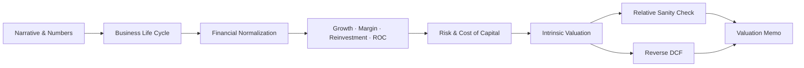

## 공개 호출 방식

```python
import importlib.resources as resources
import json

target = "005930"

system = json.loads(
    resources.files("dartlab.reference.data").joinpath("damodaranAnalysisSystem.json").read_text(encoding="utf-8")
)

concept_rows = [
    {
        "order": concept["order"],
        "concept": concept["label"],
        "status": concept["status"],
        "implementedSkills": len(concept["implementedSkills"]),
        "plannedSkills": len(concept["plannedSkills"]),
        "gapCount": len(concept["gapIds"]),
    }
    for concept in system["concepts"]
]
gap_rows = [
    {
        "order": 100 + idx,
        "concept": gap["id"],
        "status": gap["status"],
        "implementedSkills": None,
        "plannedSkills": None,
        "gapCount": 1,
    }
    for idx, gap in enumerate(system["gapLedger"], start=1)
]
engine_rows = [
    {
        "order": 200 + idx,
        "concept": item["id"],
        "status": item["status"],
        "implementedSkills": None,
        "plannedSkills": len(item["requiredBeforeEngineWork"]),
        "gapCount": 1,
    }
    for idx, item in enumerate(system["engineSupplementBacklog"], start=1)
]
sources = [
    {
        "id": "damodaranAnalysisSystemContract",
        "title": "DartLab Damodaran L1.5 analysis system contract",
        "url": "dartlab://reference/damodaranAnalysisSystem.json",
    }
]
sources.extend(
    {"id": f"damodaranOfficial_{key}", "title": f"Damodaran official {key}", "url": url}
    for key, url in system["_meta"]["officialSourceUrls"].items()
)
route_score = 0.0 if target == "138930" else system["readiness"]["decisionScore"]
route_status = "financialFirmRouteBlocked" if target == "138930" else system["readiness"]["status"]

emit_result(
    table=concept_rows + gap_rows + engine_rows,
    values={
        "decisionScore": route_score,
        "target": target,
        "readinessStatus": route_status,
        "entrySkill": system["skillTree"]["entrySkill"],
        "executableSkillCount": len(system["skillTree"]["currentExecutablePath"]),
        "gapCount": len(system["gapLedger"]),
        "engineSupplementCount": len(system["engineSupplementBacklog"]),
    },
    date=system["_meta"]["asOfDate"],
    units={"decisionScore": "score"},
    sources=sources,
)
```

## 호출 동작

### 1. 결론 도출

이 진입점은 Damodaran식 분석체계가 어디까지 실행 가능하고 어디가 아직 gap인지 먼저 판정한다. 현재의 핵심 결론은 `incubatingExecutable`이다. 즉, FCFF 중심 valuation memo 경로는 L1/L1.5 데이터만으로 실행되지만 narrative extraction, full industry defaults, peer valuation, 특수상황 모델은 별도 보강 전까지 complete로 선언하지 않는다.

### 2. 핵심 근거 수집

`damodaranAnalysisSystem.json`, `damodaranDefaults.json`, `damodaranIndustryDefaults.json`, 그리고 21개 Damodaran recipe를 함께 본다. 이 진입점은 계산을 대신하지 않고 다음 스킬로 라우팅한다.

### 3. 메커니즘 분석



Damodaran식 분석은 narrative를 숫자로 번역하고, 그 숫자를 재무제표, 기업 수명주기, 자본투입·ROC, 산업 default, 현재 가격의 내재 가정으로 반증하는 반복 구조다. `deepDive`는 실행 오케스트레이터이고, `index`는 체계·데이터 계약·gap 관리판이다.

### 4. 반례·한계

현재 스킬팩은 generic FCFF 모델이 가능한 비금융 기업에 가장 강하다. 금융업은 generic FCFF에서 차단되고, 별도 excess-return 모델이 필요하다. 순환주, 원자재, 지주회사, distress, segment sum-of-parts는 gap ledger에 남긴다.

### 5. 후속 모니터링

다음 보강 순서는 narrative alias, cycle-normalized margins, R&D/lease/one-off 조정, full industry reference sync, US peer valuation primitive, financial firm model이다. 모든 gap은 `filled`, `fallbackAccepted`, `deferredWithBlocker` 중 하나로 유지한다.

## 대표 반환 형태

`damodaranAnalysisSystem : dict` — `concepts`, `skillTree`, `dataContract`, `gapLedger`, `engineSupplementBacklog`, `completionGates`, `readiness`를 담는다.

## 엔진 보강 후보

스킬 안정화 전에는 엔진을 손대지 않는다. 현재 엔진 보강 후보는 `damodaranAnalysisSystem.json`의 `engineSupplementBacklog`에 고정한다.

1. `storyboardSchemaBridge` - `deepDive.storyboardReady`를 Story 엔진 schema로 연결.
2. `valuationMemoAdapter` - L1.5 memo를 valuation 엔진의 provenance-rich 입력으로 소비.
3. `nonGenericFcffModelRouter` - 금융업, 지주, distress, 원자재, 순환주 모델 라우팅.
4. `industryPeerValuationPrimitive` - peer universe와 comparable multiple primitive 보강.
5. `assumptionProvenanceSurface` - source trace, fallback reason, confidence, falsifier status를 API/UI/Story 표면에 노출.

## 연계 절차

1. recipes.valuation.damodaran.dataAudit - L1/L1.5 데이터 가능성 확인.
2. recipes.valuation.damodaran.businessModelFit - 일반 FCFF 가능 여부와 특수상황 차단.
3. recipes.valuation.damodaran.lifeCycleClassifier - 성장·마진·ROC-WACC spread 기반 수명주기 분류.
4. recipes.valuation.damodaran.narrativeMap - 사업 스토리와 valuation driver 연결.
5. recipes.valuation.damodaran.storyToDrivers - narrative를 수치 가정으로 변환.
6. recipes.valuation.damodaran.normalizedFinancials - valuation용 재무 패널.
7. recipes.valuation.damodaran.accountTraceAudit - valuation 입력값의 계정 trace 감사.
8. recipes.valuation.damodaran.rdCapitalization - R&D 자본화 감사.
9. recipes.valuation.damodaran.leaseDebtAdjustment - 리스부채 조정 감사.
10. recipes.valuation.damodaran.oneOffAdjustment - 일회성 항목 정규화 감사.
11. recipes.valuation.damodaran.reinvestmentRoc - 성장·재투자·ROC 정합성.
12. recipes.valuation.damodaran.growthFeasibility - 성장률이 재투자율과 ROC로 설명되는지 반증.
13. recipes.valuation.damodaran.costOfCapital - WACC와 reference fallback.
14. recipes.valuation.damodaran.fcffDcf - FCFF 가치 밴드.
15. recipes.valuation.damodaran.relativeCheck - 상대가치 sanity check.
16. recipes.valuation.damodaran.peerMultipleDecomposition - multiple을 driver로 분해.
17. recipes.valuation.damodaran.financialFirmExcessReturn - 금융업 excess-return 경로.
18. recipes.valuation.damodaran.sumOfParts - 세그먼트/SOTP 경로.
19. recipes.valuation.damodaran.distressAdjustedDcf - distress 조정 DCF 경로.
20. recipes.valuation.damodaran.scenarioFalsifier - reverse DCF와 반증.
21. recipes.valuation.damodaran.deepDive - 최종 valuation memo.

## 기본 검증

- `damodaranAnalysisSystem.json`의 개념 트리는 10개 축을 모두 포함해야 한다.
- 모든 concept는 구현 스킬, 계획 스킬, 데이터 요구사항, gap id를 가져야 한다.
- 모든 gap은 `filled`, `fallbackAccepted`, `deferredWithBlocker` 중 하나로 분류되어야 한다.
- 엔진 보강 후보는 `engineSupplementBacklog`에 남기되, 스킬 phase에서는 `doNotImplementInSkillPhase`를 유지해야 한다.
- 21개 실행 recipe는 5개 고정 타깃에서 `ValidateRecipe` evidence completeness 1.00을 통과해야 한다.
- `strict-l0-l15` guard 통과 전에는 complete 선언 금지.
