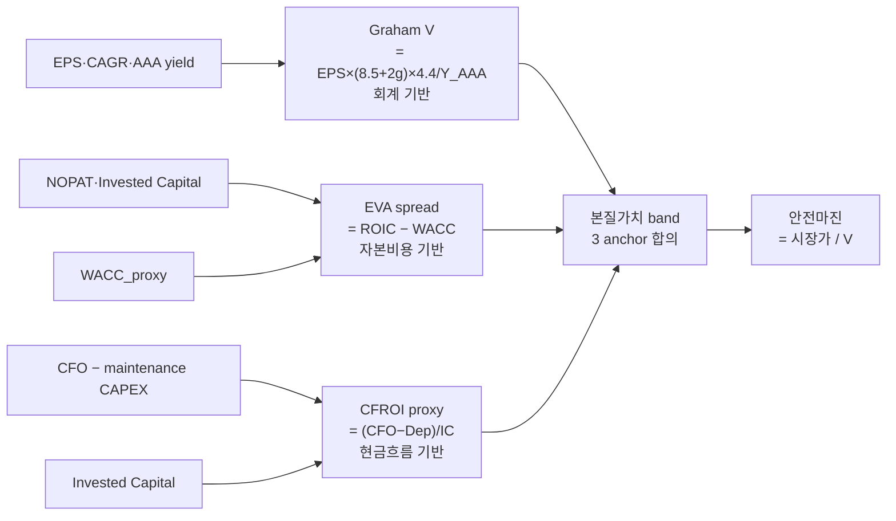

## 학술 근거

3 학술 framework 동시 적용 — 회계 기반 (Graham), 자본비용 기반 (EVA), 현금흐름 기반 (CFROI) 의 3 anchor 가 서로 다른 가정 → 합의 시 본질가치 band.

### 1. Graham 수정공식 (1974)
Benjamin Graham, *Intelligent Investor* + 1974 Toronto 강연에서 수정:

V = EPS × (8.5 + 2g) × 4.4 / Y_AAA

| 항 | 의미 |
|---|---|
| 8.5 | 무성장 회사 적정 PER |
| 2g | 성장률 (%) × 2 |
| 4.4 | 1962 AAA 회사채 yield 정규화 상수 |
| Y_AAA | 현재 AAA 회사채 yield (%) |

검증:
- 1962-2000 미국 백테스트 — 본 공식 V × 0.5 &lt; 시장가 = 안전마진. 매수 후 5 년 평균 +6%p 초과수익.

### 2. EVA Spread (Stern Stewart, 1991)
G. Bennett Stewart III, *The Quest for Value*:

EVA = NOPAT − (WACC × Invested Capital)
    = (ROIC − WACC) × Invested Capital

본 recipe 의 *spread* 만 측정:

ROIC = NOPAT / Invested Capital = (EBIT × (1−taxRate)) / (Equity + LongTermDebt)
spread = ROIC − WACC_proxy

WACC_proxy = 7% (한국 평균), 8% (미국 평균) — 단순 가정.

검증:
- Stewart (1991): EVA spread 와 stock price correlation 0.50-0.65 (회계 EPS 보다 높음).
- O'Byrne-Young (2000): 5 년 EVA 변화가 5 년 stock return 과 강한 상관.

### 3. CFROI Proxy (HOLT)
Bartley Madden, *CFROI Valuation* (1999):

원전 CFROI = 인플레이션 조정 IRR over asset life. 본 recipe 의 단순 proxy:

CFROI_proxy = (CFO − maintenance CAPEX) / Invested Capital
maintenance CAPEX ≈ depreciation expense (가정)

검증:
- HOLT 데이터베이스 (1950-2020): CFROI &gt; WACC 인 회사가 미래 stock return 우월. 회계 ROE 보다 noise 적음.

## 공개 호출 방식

```python
import dartlab
import polars as pl

c = dartlab.Company("005930")

is_df = c.show("IS", freq="Y")
bs_df = c.show("BS", freq="Y")
cf_df = c.show("CF", freq="Y")
fq_df = c.show("FQ", freq="Y")  # EPS 등 비율
years = ["2025", "2024", "2023", "2022", "2021"]

def fetchSeries(df: pl.DataFrame, snake: str, years: list[str]) -> list[float]:
    row = df.filter(pl.col("snakeId") == snake).select(years)
    return row.to_numpy()[0].tolist() if row.height > 0 else [0.0] * len(years)

ni = fetchSeries(is_df, "net_income", years)
op = fetchSeries(is_df, "operating_profit", years)
ebt = fetchSeries(is_df, "earnings_before_tax", years)
sales = fetchSeries(is_df, "sales", years)
equity = fetchSeries(bs_df, "total_stockholders_equity", years)
ltd = fetchSeries(bs_df, "long_term_debt", years)
cfo = fetchSeries(cf_df, "cash_flow_from_operations", years)
dep = fetchSeries(is_df, "depreciation_expense", years)
eps = fetchSeries(fq_df, "eps_basic", years)

# 1) Graham 수정공식 — EPS 5 년 평균, 성장률 = 5 년 CAGR
epsAvg = sum(eps[:5]) / 5
epsCagr = ((eps[0] / eps[4]) ** (1/4) - 1) * 100 if eps[4] > 0 else 0
yAaa = 4.5  # 한국 회사채 AAA yield 가정 (외부 fetch 필요)
grahamV = epsAvg * (8.5 + 2 * epsCagr) * 4.4 / yAaa

# 2) EVA spread — 당년
taxRate = 1 - (ni[0] / ebt[0]) if ebt[0] > 0 else 0.25
nopat = op[0] * (1 - taxRate)
investedCapital = equity[0] + ltd[0]
roic = nopat / investedCapital * 100 if investedCapital > 0 else None
waccProxy = 7.0  # 한국 평균 가정
evaSpread = roic - waccProxy if roic is not None else None

# 3) CFROI proxy — 5 년 평균
cfroiSeries = [
    (cfo[i] - dep[i]) / (equity[i] + ltd[i]) * 100 if (equity[i] + ltd[i]) > 0 else None
    for i in range(len(years))
]
cfroi5y = sum(c for c in cfroiSeries if c is not None) / len([c for c in cfroiSeries if c is not None])

valueBand = pl.DataFrame({
    "anchor": ["Graham_V", "EVA_spread", "CFROI_5y_avg"],
    "value": [grahamV, evaSpread, cfroi5y],
    "interpretation": [
        f"본질가치 EPS 기준 = {grahamV:.0f}원 / 시장가와 비교",
        f"ROIC − WACC = {evaSpread:.1f}%p (양수 = 가치 창출)",
        f"5 년 평균 CFROI = {cfroi5y:.1f}% (WACC 7% 와 비교)",
    ],
})
```

## 호출 동작 — 5 단 분석 구조

답변은 분석 5 단 (결론 / 근거 / 메커니즘 / 반례·한계 / 후속 모니터링) 매핑. 3 anchor (Graham · EVA spread · CFROI proxy) 결과를 본질가치 band 로 묶어 답안 구성.

### 1. 결론 도출

회사의 *본질가치 band + 현재 시장가 위치 + 3 anchor 합의도* 한 문장 정량 결론.

좋은 결론 예시:
- "005930 (삼성전자) 본질가치 band 60,000~85,000 원 (Graham V 72,000 / EVA spread +3.2%p 가치 창출 / CFROI 9.8% > WACC 7%), 현재가 71,500 원 = band 중앙 +1%. **3 anchor 일관 가치 창출** — fair value 근방, 안전마진 부재."
- "OOOOOO band 18,000~32,000 원 (Graham 22,000 / EVA -1.5%p 가치 파괴 / CFROI 5.2% < WACC 7%), 현재가 14,500 원 = band 하단 -19%. **2/3 anchor 약세 + 시장가 하단 이탈** — value trap 가능성, 보수적 접근."

금지 — 단일 anchor (Graham 만 또는 EVA 만) 결과로 fair value 단정. 반드시 **3 anchor 모두 산출 + band 형태**.

### 2. 핵심 근거 수집

`requiredEvidence: skillRef + tableRef + valueRef + dateRef` 4 종 명시.

- **skillRef**: `engines.gather` 또는 `engines.company.show` (L1 raw IS/BS/CF/FQ), `engines.scan.valuation` (PER/PBR snapshot 비교용). analysis valuation axis 의존 X.
- **sourceRef**: DART 공시 — IS (sales, operating_profit, earnings_before_tax, net_income, depreciation), BS (total_stockholders_equity, long_term_debt), CF (cash_flow_from_operations), FQ (eps_basic). 5 년 연간 시계열.
- **외부 가정**: AAA yield (Y_AAA 4.0~5.0%), WACC_proxy (KR 7% / US 8%) — 답변에 가정 명시 + 민감도 (±1%) 동반.
- **tableRef** (3 행 anchor): anchor × {value, interpretation, marketPriceComparison}.
- **valueRef**: Graham V · EVA spread · CFROI 5y avg · 현재 시장가 · 안전마진 비율 (V/Market).
- **dateRef**: 5 회계년도 + 시장가 snapshot date.

도구: `RunPython` (4 raw 호출 + 9 변수 추출 + 3 anchor 계산).

### 3. 메커니즘 분석

3 anchor 가 *서로 다른 가정* 으로 본질가치를 추정 — 합의 시 band claim.



각 anchor *해석* (답변 본문):
- **Graham V**: 회계 EPS·성장률 + AAA yield 보정. 시장가 < V × 0.5 = deep value 안전마진. Graham 1962-2000 백테스트 +6%p 초과수익.
- **EVA spread**: ROIC − WACC. +값 = 자본 효율 우월 (자본 창출). -값 = 자본 파괴 (장기 deteriorate). Stewart 1991 correlation 0.50-0.65.
- **CFROI proxy**: 현금 ROIC. 회계 ROE 보다 noise 적음. HOLT 1950-2020 — CFROI > WACC 회사 미래 stock return 우월.

**3 anchor 합의 게이트**: 모두 *저평가* (V > 시장가, spread > 0, CFROI > WACC) → 강한 매수 신호. 1~2 anchor 만 합의 → watch.

### 4. 반례·한계

- **Falsifier**: 3 anchor 중 1~2 만 합의해도 fair value 단정 금지 — 3 anchor 일관 시만 band claim.
- **가정 민감도**: AAA yield ±1%, WACC ±2% 변화 시 V/spread/CFROI 변화 큼. 답변에 가정 + 민감도 (low/base/high 3 케이스) 동반 권장.
- **Graham 1974 미국 표본**: KR 시장 직접 검증 부재. KR chaebol 회계 (지주·자회사 internal trading) 으로 EPS noise 가능.
- **EVA WACC proxy**: 산업·국가·회사별 다름. CAPM (beta + risk-free + ERP) 정확. 본 recipe 는 7%/8% 단순 가정.
- **CFROI 단순화**: 원전 (HOLT) 은 인플레이션 조정 IRR over asset life. 본 proxy 는 (CFO − Dep) / IC — asset vintage·inflation 미보정.
- **EPS CAGR 사이클**: 5 년 CAGR 가 사이클 시작/끝 노이즈 (조선·반도체). 더 긴 (10 년) 또는 정상화 EPS 권장.
- **음수 영업이익**: 적자 회사는 EVA spread·CFROI 음 무한대 가능 — band 산출 X.
- **금융업 부적합**: 은행·보험 IC 정의 다름 (예금·보험료). 별도 framework.
- **시가총액 시계열 결합 X**: `c.show("PRICE")` 마지막 종가만. 추세 비교 별 처리.
- **failureModes** — AAA yield KR 적합성 / WACC CAPM 가정 / CFROI inflation 누락 / 3 anchor 가정 차이로 band 폭 큼 / 시점 차이.

### 5. 후속 모니터링

답변 끝에 모니터링 표:

| 신호 | 현재값 | 임계값 | 리뷰 주기 |
|---|---|---|---|
| Graham V vs 시장가 | (계산) | 시장가 < V × 0.5 = 매수 | 분기 |
| EVA spread | (계산) | > 0 (가치 창출) | 분기 |
| CFROI − WACC | (계산) | > 0 (자본 효율) | 분기 |
| AAA yield (Y_AAA) | (gather) | ±50bp | 월간 |
| WACC 추정 (CAPM) | (계산) | beta 재계산 시 | 연간 |
| 시장가 / V (안전마진) | (계산) | < 50% = 강한 매수 | 일간 |

연계 절차:
- EVA spread > 0 + CFROI > WACC → `recipes.screen.compounderCandidates` 합의 (진짜 quality)
- EVA spread < 0 + CFROI < WACC → `recipes.credit.distressFilter` (자본 파괴)
- 5 년 EVA spread 안정 양수 = quality compounder → `recipes.quality.dupontDriver` 결합
- PER/PBR 정량 매트릭스 → `engines.scan.valuation` snapshot 비교
- 자본 배분 효율 → `recipes.quality.capitalAllocationScorecard`

재호출 트리거: "삼성전자 3 anchor 본질가치 band", "Graham + EVA + CFROI 결합", "시장가 vs 본질가치 band 비교".

## 대표 반환 형태

`valueBand : pl.DataFrame` — 컬럼:
- `anchor : str` — Graham_V / EVA_spread / CFROI_5y_avg
- `value : float` — 추정값
- `interpretation : str` — 시장가 비교 해석 1 문장

추가 가능 — 시장가 (`c.show("PRICE")` 마지막 종가) 와 비교한 정량 안전마진 컬럼.

## 한계

- **Graham AAA yield 가정** — 본 recipe 는 4.5% 고정. 실제는 한국 회사채 AAA 일평 yield 변동. 외부 fetch 필요. 또는 AA- 등급 회사채 yield 사용 권장.
- **EVA WACC proxy 7%** — 산업·국가·회사 별 다름. 정확한 WACC 는 산업 beta + risk-free rate + ERP 결합. 본 recipe 는 단순 가정.
- **CFROI 단순화** — 원전은 인플레이션 조정 IRR over asset life. 본 recipe 는 현금 ROIC 근사. asset vintage 미반영.
- **EPS CAGR 5 년** — 사이클 회사는 5 년 CAGR 가 사이클 시작/끝 노이즈. 더 긴 기간 (10 년) 또는 정상화 EPS 권장.
- **시가총액 시계열 결합 X** — `c.show("PRICE")` 의 마지막 종가만 사용 가능. 추세 비교는 별 처리.

## 한국 / 미국 시장 차이

- **한국**: AAA yield 평균 4.0-4.5%. WACC 평균 7%. Graham V 적용 가능. EVA spread 평균 −1%p (ROIC 평균 6% &lt; WACC 7%) — 한국 chaebol 자본 비효율 신호.
- **미국**: AAA yield 평균 4.5-5.0%. WACC 평균 8%. EVA spread 평균 +2%p (ROIC &gt; WACC) — 자본 효율 우월. CFROI 데이터베이스 본 시장.

## 연계 절차

1. 본 recipe → 3 anchor 표 + 해석.
2. Graham V vs 시장가 — 시장가 &lt; V × 0.5 = 안전마진 (deep value).
3. EVA spread &gt; 0 + CFROI &gt; WACC = 진짜 capital efficiency → `recipes.screen.compounderCandidates` 와 합의.
4. EVA spread &lt; 0 + CFROI &lt; WACC = 자본 파괴 → `recipes.credit.distressFilter` 와 결합 검토.
5. 5 년 EVA spread 추세 — 안정 + 양수 = quality compounder, 변동 큼 = 사이클.
6. `engines.scan.valuation` 의 PER/PBR snapshot 과 본 anchor 비교 — 시장 multiple vs 본질가치 ratio.

## 기본 검증

- 3 anchor 합의 — 모두 *저평가* 신호 (V &gt; 시장가, spread &gt; 0, CFROI &gt; WACC) 시 강한 매수 신호.
- 단일 anchor 의존 X — Graham V 만 본 결정 위험.
- 5 년 추세 확인 — 단년도 spread 는 일시적, 5 년 평균이 본질.
- AAA yield + WACC 가정의 민감도 점검 — yield ±1%, WACC ±2% 변화 시 결과 변화 검증.
- "V = 100,000 원 = 매수" 단정 X — 본질가치는 추정. 시장가 &lt; V × 0.5 의 안전마진 게이트 필수.
